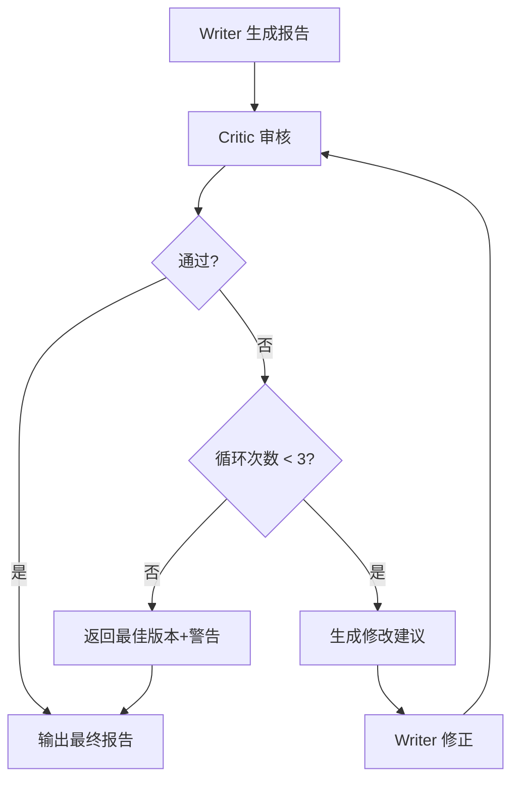
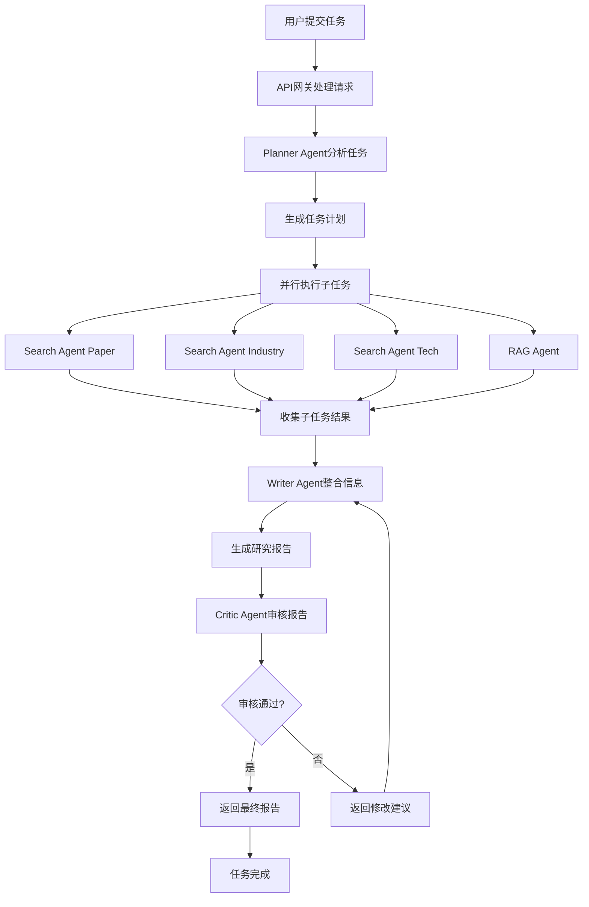
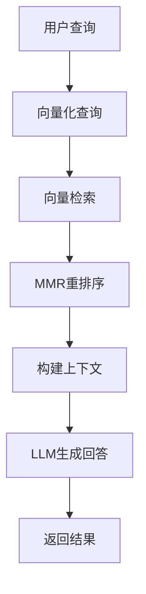
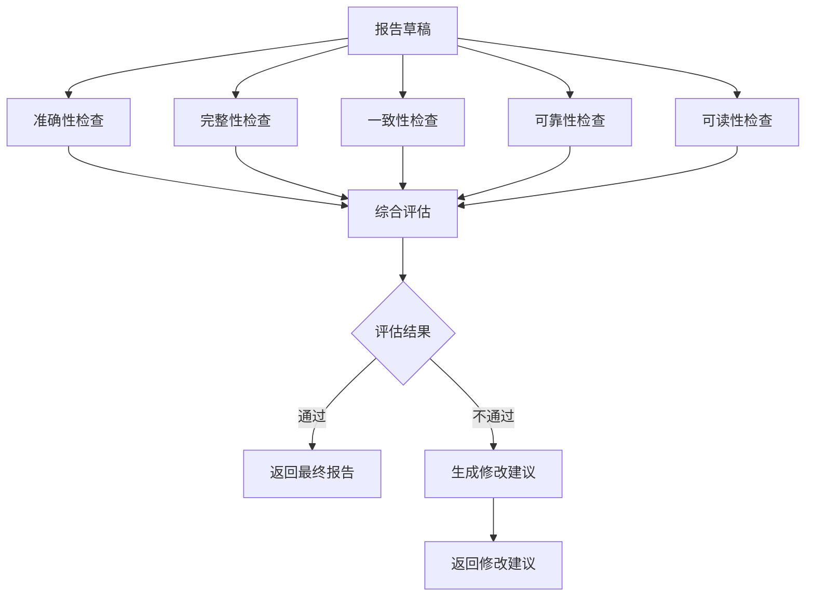

# Multi-Agent Research Assistant

> 基于 LangChain 的多 Agent 协作研究助手，支持 RAG 检索、任务规划与协同写作

## 1. 项目概述

### 1.1 项目目标

本项目旨在构建一个智能的多 Agent 协作系统，通过专业化分工和协同工作，高效完成复杂的研究任务。系统能够自动分解任务、搜集信息、整合分析并生成高质量的研究报告。

### 1.2 应用场景

- **学术研究**：快速调研特定领域的最新进展和研究趋势
- **行业分析**：收集市场信息、技术动态和竞争情报
- **技术评估**：评估新技术的应用前景和可行性
- **知识管理**：整合企业内部知识库和外部信息源

### 1.3 系统价值

- **提高效率**：自动化完成信息搜集和分析过程，减少人工工作
- **增强深度**：多视角分析，提供更全面、深入的研究结果
- **保证质量**：通过多轮审核和反馈机制，确保输出内容的准确性和可靠性
- **可扩展性**：模块化设计，易于添加新的 Agent 类型和功能

## 2. 设计原则

- **模块化**：各 Agent 职责明确，独立可扩展
- **协作性**：通过 Planner Agent 实现 Agent 间的有效协作
- **可靠性**：单个 Agent 失败不影响整体系统运行
- **可追溯性**：完整记录各 Agent 的执行过程和结果
- **可配置性**：支持通过配置文件调整系统参数和行为

## 3. 核心架构

```
用户: "帮我调研 2024 年 AI Agent 的进展"

┌─────────────────────────────────────────────────────────┐
│                    用户输入                          │
└─────────────────┬───────────────────────────────────────────┘
                │
                ▼
┌─────────────────────────────────────────────────────────┐
│              Planner Agent (规划)                     │
│  - 分解任务为子任务                                │
│  - 分配给专业 Agent                               │
│  - 整合结果                                      │
└─────────────────┬───────────────────────────────────────┘
                │
        ┌───────┴────────┬───────────┬──────────┐
        ▼              ▼          ▼          ▼
┌───────────┐ ┌───────────┐ ┌───────────┐ ┌───────────┐
│Search Agent│ │Search    │ │Search    │ │RAG Agent │
│ (论文)   │ │Agent     │ │Agent     │ │(知识库)  │
│          │ │(工业应用)│ │(技术突破)│ │          │
└────┬────┘ └────┬────┘ └────┬────┘ └───┬────┘
     │            │            │            │
     └────────────┴────────────┴────────────┘
                        │
                        ▼
┌─────────────────────────────────────────────────────────┐
│              Writer Agent (写作)                      │
│  - 整合多个 Agent 的结果                            │
│  - 生成结构化报告                                 │
└─────────────────┬───────────────────────────────────────┘
                │
                ▼
┌─────────────────────────────────────────────────────────┐
│              Critic Agent (审核)                    │
│  - 质量检查                                     │
│  - 逻辑一致性验证                                │
│  - 决定通过或返工                              │
└─────────────────────────────────────────────────┘
```

## 4. Agent 角色定义

### 4.1 Planner Agent

**角色定位**：系统的中枢神经，负责任务规划与调度

**核心职责**：
- 分析用户问题，识别任务类型和需求
- 设计任务分解策略，将复杂任务拆分为可执行的子任务
- 为每个子任务选择最合适的专业 Agent
- 制定执行计划，确定子任务的执行顺序（并行/串行）
- 监控子任务执行状态，处理异常情况
- 汇总各 Agent 的执行结果，形成初步结论

**任务分解策略**：

1. **分解模式选择**：
   | 模式 | 适用场景 | 示例 |
   |------|---------|------|
   | **列表模式** | 子任务相对独立，无强依赖 | 并行搜索多个主题 |
   | **树结构模式** | 子任务有依赖，需分层处理 | 调研 → 分析 → 写作 |
   | **链式模式** | 后置任务依赖前置结果 | 搜索 → 筛选 → 总结 |

2. **执行顺序策略**：
   | 策略 | 判定条件 | 优缺点 |
   |------|---------|--------|
   | **全部并行** | 子任务完全独立 | 速度快，但可能获取冗余信息 |
   | **全部串行** | 子任务强依赖 | 结果质量高，但速度慢 |
   | **分组并行** | 任务有分组依赖 | 平衡质量和速度 |

3. **任务依赖关系定义**：
   ```python
   # 任务依赖模型
   class SubTask:
       id: str              # 子任务ID
       agent_type: str      # Agent类型
       description: str     # 任务描述
       dependencies: List[str]  # 依赖的子任务ID
       priority: int       # 优先级 (1-10)
       timeout: int       # 超时时间(秒)
   ```

**任务分解Prompt设计**：
```
你是一个专业的任务规划专家。请分析用户的研究任务，并制定详细的执行计划。

## 用户任务
{user_query}

## 可用的Agent类型
- Search-Agent-Paper: 搜索学术论文
- Search-Agent-Industry: 搜索工业应用
- Search-Agent-Tech: 搜索技术突破
- RAG-Agent: 查询知识库
- Writer-Agent: 撰写报告
- Critic-Agent: 审核质量

## 请按以下步骤分析

### 1. 任务类型识别
这个任务属于哪种类型？（单点调研 / 全面调研 / 对比分析 / 技术评估 / 其他）

### 2. 需要哪些方面的信息
列出完成任务需要的所有信息维度。

### 3. 任务分解
将任务分解为子任务，每个子任务包含：
- 子任务ID
- Agent类型
- 任务描述
- 预期输出

### 4. 执行顺序规划
分析子任务之间的依赖关系，决定：
- 分组：哪些任务可以并行执行
- 顺序：哪些任务必须串行执行

### 5. 异常处理预案
如果某个子任务失败，如何处理？
- 重试策略
- 回退策略
- 降级策略

## 输出格式
请按以下JSON格式输出：
```json
{
    "task_type": "...",
    "information_dimensions": ["维度1", "维度2", ...],
    "execution_plan": {
        "groups": [
            {
                "group_id": 1,
                "parallel": true,
                "tasks": [
                    {
                        "task_id": "task_1_1",
                        "agent_type": "Search-Agent-Paper",
                        "description": "...",
                        "expected_output": "...",
                        "timeout": 30
                    }
                ]
            }
        ],
        "serial_DEPENDENCIES": [
            ["task_1_1", "task_2_1"]  # task_2_1依赖task_1_1
        ]
    },
    "fallback_strategy": {
        "if_search_fails": "跳过并记录，使用其他来源",
        "if_rag_fails": "仅依赖网络搜索",
        "if_writer_fails": "返回所有搜索结果摘要"
    }
}
```
```

**执行计划示例**：
```
输入："帮我调研 2024 年 AI Agent 的进展"
输出：
{
    "task_type": "全面调研",
    "information_dimensions": ["学术研究", "工业应用", "技术突破", "知识库"],
    "execution_plan": {
        "groups": [
            {
                "group_id": 1,
                "parallel": true,
                "tasks": [
                    {
                        "task_id": "search_paper",
                        "agent_type": "Search-Agent-Paper",
                        "description": "搜索2024年AI Agent学术论文",
                        "expected_output": "论文列表+核心贡献"
                    },
                    {
                        "task_id": "search_industry",
                        "agent_type": "Search-Agent-Industry",
                        "description": "搜索AI Agent工业应用案例",
                        "expected_output": "应用案例列表"
                    },
                    {
                        "task_id": "search_tech",
                        "agent_type": "Search-Agent-Tech",
                        "description": "搜索AI Agent技术突破",
                        "expected_output": "技术进展列表"
                    },
                    {
                        "task_id": "rag_knowledge",
                        "agent_type": "RAG-Agent",
                        "description": "查询知识库中的AI Agent信息",
                        "expected_output": "相关知识片段"
                    }
                ]
            }
        ]
    },
    "aggregator": "整合所有搜索结果，形成结构化摘要",
    "fallback_strategy": "任一搜索失败则跳过，知识库失败仅用网络搜索"
}
```

**结果聚合策略**：
```python
# 结果聚合实现
def aggregate_results(results: List[Dict]) -> str:
    """聚合多个Agent的结果"""
    aggregated = {
        "papers": [],
        "industries": [],
        "techs": [],
        "knowledge": []
    }
    
    for result in results:
        result_type = result.get("type")
        if result_type in aggregated:
            aggregated[result_type].extend(result.get("findings", []))
    
    # 按维度组织，生成摘要
    summary = "# 研究发现摘要\n\n"
    for dimension, findings in aggregated.items():
        if findings:
            summary += f"## {dimension}\n"
            for finding in findings:
                summary += f"- {finding}\n"
            summary += "\n"
    
    return summary
```

**工具使用**：
- 无特定工具，主要依赖 LLM 的推理能力

**Prompt 设计要点**：
- 明确任务边界和目标
- 定义子任务的详细描述和预期输出
- 指定执行顺序和依赖关系
- 设计异常处理策略

### 4.2 Search Agent × 3

**角色定位**：信息搜集专家，从不同角度获取外部信息

**核心职责**：
- 根据分配的子任务，制定搜索策略
- 执行搜索操作，获取相关信息
- 筛选和整理搜索结果，提取关键信息
- 生成结构化的信息摘要

**专业分工**：

| Agent | 搜索角度 | 数据源 | 搜索策略 |
|-------|---------|-------|----------|
| Search-Agent-Paper | 学术论文 | arXiv / 论文库 / 学术搜索引擎 | 关键词搜索 + 论文摘要分析 |
| Search-Agent-Industry | 工业应用 | 新闻网站 / 行业博客 / 公司官网 | 案例分析 + 市场趋势 |
| Search-Agent-Tech | 技术突破 | GitHub / 技术文档 / 开发者社区 | 代码库分析 + 技术博客 |

**共用工具**：
- 搜索工具：执行网络搜索
- Web Fetch：获取网页内容
- 文本分析工具：提取和整理信息

#### 4.2.1 Search-Agent-Paper Prompt（学术论文）

```
# 搜索Prompt - 学术论文角度
SYSTEM_PROMPT = """你是一个专业的学术论文搜索专家。你的任务是从学术数据库和论文平台搜索相关论文。

## 你的专业领域
[此处根据具体任务填充，如：AI Agent / LLM / RAG]

## 数据源优先级
1. arXiv (arxiv.org) - 预印本论文
2. Semantic Scholar - 学术搜索引擎
3. Google Scholar - 谷歌学术
4. Papers with Code - 带代码的论文

## 搜索策略
1. 使用英文关键词搜索（国际数据库）
2. 按引用量排序，优先高质量论文
3. 关注近2年的最新论文
4. 提取论文的核心贡献和方法

## 输出格式要求
请按以下JSON格式输出：
```json
{
    "papers": [
        {
            "title": "论文标题",
            "authors": ["作者1", "作者2"],
            "venue": "发表会议/期刊",
            "year": 2024,
            "abstract": "摘要（100-200字）",
            "core_contribution": "核心贡献",
            "method": "使用方法",
            "url": "论文链接",
            "citations": 100
        }
    ],
    "trends": ["趋势1", "趋势2"],
    "key_works": ["标志性工作1", "标志性工作2"]
}
```

## 注意事项
- 只返回真实存在的论文，不要编造
- 如果搜索结果太少，扩大关键词
- 优先选择有代码仓库的论文
"""

USER_PROMPT_TEMPLATE = """请搜索以下领域的学术论文：
{query}

要求：
1. 搜索近2年（2023-2024）的高质量论文
2. 找出核心贡献和方法
3. 识别研究趋势
4. 至少返回5篇相关论文
"""
```

#### 4.2.2 Search-Agent-Industry Prompt（工业应用）

```
# 搜索Prompt - 工业应用角度
SYSTEM_PROMPT = """你是一个行业信息搜集专家。你的任务是搜索技术在不同行业的应用案例。

## 你的专业领域
[此处根据具体任务填充]

## 数据源优先级
1. 科技公司官网blog
2. 行业报告（如IDC、Gartner）
3. 技术新闻（36氪、虎嗅、InfoQ）
4. 行业垂直媒体

## 搜索策略
1. 搜索 "[技术] + 应用案例"
2. 搜索 "[公司] + [技术] + 实践"
3. 搜索 "[行业] + [技术] + 解决方案"
4. 关注具体落地案例和效果数据

## 输出格式要求
```json
{
    "applications": [
        {
            "company": "公司/组织名称",
            "industry": "所属行业",
            "use_case": "具体应用场景",
            "solution": "解决方案描述",
            "results": {
                "efficiency_gain": "效率提升XX%",
                "cost_reduction": "成本降低XX%",
                "other_benefits": "其他收益"
            },
            "source": "信息来源",
            "url": "链接"
        }
    ],
    "market_trends": ["趋势1", "趋势2"],
    "leading_players": ["领先企业1", "领先企业2"]
}
```
"""

USER_PROMPT_TEMPLATE = """请搜索以下技术在工业界的应用案例：
{query}

要求：
1. 找出具体的公司应用案例
2. 提取可量化的效果数据
3. 分析市场趋势
4. 至少返回5个应用案例
"""
```

#### 4.2.3 Search-Agent-Tech Prompt（技术突破）

```
# 搜索Prompt - 技术突破角度
SYSTEM_PROMPT = """你是一个技术信息搜索专家。你的任务是搜索技术的最新进展和突破。

## 你的专业领域
[此处根据具体任务填充]

## 数据源优先级
1. GitHub Trending
2. 技术博客（Medium、Dev.to）
3. 开发者社区（Stack Overflow、Hacker News）
4. 技术文档更新日志

## 搜索策略
1. 搜索 "[技术] + GitHub" 找开源项目
2. 搜索 "new [技术] library/framework"
3. 关注GitHub Star数和更新频率
4. 分析技术实现方案

## 输出格式要求
```json
{
    "breakthroughs": [
        {
            "project_name": "项目/库名称",
            "description": "项目描述",
            "github_url": "GitHub链接",
            "stars": 1000,
            "tech_stack": ["技术栈"],
            "innovation": "创新点",
            "recent_update": "2024-01"
        }
    ],
    "tools_frameworks": [
        {
            "name": "工具/框架名",
            "category": "类别",
            "key_features": ["特性1", "特性2"]
        }
    ],
    "community_trends": ["社区趋势1", "社区趋势2"]
}
```
"""

USER_PROMPT_TEMPLATE = """请搜索以下领域的技术突破和开源项目：
{query}

要求：
1. 搜索活跃的开源项目
2. 分析技术创新点
3. 识别主流技术栈
4. 至少返回5个项目
"""
```

#### 4.2.4 Search Agent 统一执行框架

```python
from enum import Enum
from typing import Dict, List, Optional

class SearchAngle(Enum):
    PAPER = "paper"        # 学术论文
    INDUSTRY = "industry"   # 工业应用
    TECH = "tech"        # 技术突破

class SearchAgent:
    """统一的搜索Agent"""
    
    def __init__(self, angle: SearchAngle):
        self.angle = angle
        self.prompt_templates = {
            SearchAngle.PAPER: self._get_paper_prompt(),
            SearchAngle.INDUSTRY: self._get_industry_prompt(),
            SearchAngle.TECH: self._get_tech_prompt()
        }
    
    def execute(self, query: str, search_tool) -> Dict:
        """执行搜索"""
        # 构造prompt
        system_prompt = self.prompt_templates[self.angle]["system"]
        user_prompt = self.prompt_templates[self.angle]["user"].format(query=query)
        
        # 调用LLM生成搜索关键词
        keywords = self._generate_keywords(query, system_prompt)
        
        # 执行搜索
        results = []
        for keyword in keywords:
            search_results = search_tool.search(keyword)
            results.extend(search_results)
        
        # 调用LLM整理结果
        organized = self._organize_results(results, system_prompt)
        
        return organized
    
    def _generate_keywords(self, query: str, system_prompt: str) -> List[str]:
        """生成搜��关键词"""
        # 构造prompt让LLM生成关键词
        prompt = f"""{system_prompt}

请为以下查询生成搜索关键词（英文，3-5个）：
{query}
"""
        keywords = llm.generate(prompt).split("\n")
        return [k.strip() for k in keywords if k.strip()]
    
    def _organize_results(self, results: List[Dict], system_prompt: str) -> Dict:
        """整理搜索结果"""
        # 构造prompt让LLM按指定格式整理
        results_text = json.dumps(results, ensure_ascii=False)
        prompt = f"""{system_prompt}

请按上述格式整理以下搜索结果：
{results_text}
"""
        organized = llm.generate_json(prompt)
        return organized
```

#### 4.2.5 搜索工具备选（国内环境）

```python
# 国内环境搜索工具备选
class SearchToolFactory:
    """搜索工具工厂，根据环境返回合适的工具"""
    
    @staticmethod
    def get_search_tool(provider: str = "auto"):
        """
        provider选项：
        - "auto": 自动选择可用工具
        - "duckduckgo": DuckDuckGo
        - "baidu": 百度搜索API
        - "serper": Google Serper
        """
        if provider == "baidu":
            return BaiduSearchTool()
        elif provider == "serper":
            return SerperSearchTool()
        elif provider == "duckduckgo":
            return DuckDuckGoSearchTool()
        else:
            # 自动选择可用工具
            return AutoSelectSearchTool()

class BaiduSearchTool:
    """百度搜索工具（需申请API）"""
    
    def __init__(self, api_key: str = None):
        # 需要从百度开放平台申请
        self.api_key = api_key or os.getenv("BAIDU_API_KEY")
    
    def search(self, query: str, num: int = 10) -> List[Dict]:
        # 调用百度搜索API
        url = "https://api.baidu.com/some/search"
        # ... 实现

class SerperSearchTool:
    """Google Serper搜索（需API Key）"""
    
    def __init__(self, api_key: str = None):
        self.api_key = api_key or os.getenv("SERPER_API_KEY")
    
    def search(self, query: str, num: int = 10) -> List[Dict]:
        import requests
        url = "https://google.serper.dev/search"
        headers = {"X-API-KEY": self.api_key}
        params = {"q": query, "num": num}
        response = requests.get(url, headers=headers, params=params)
        return self._parse_results(response.json())

class AutoSelectSearchTool:
    """自动选择可用工具"""
    
    def search(self, query: str, num: int = 10) -> List[Dict]:
        # 依次尝试各个工具
        for tool_class in [DuckDuckGoSearchTool, SerperSearchTool, BaiduSearchTool]:
            try:
                tool = tool_class()
                results = tool.search(query, num)
                if results:
                    return results
            except:
                continue
        return []  # 所有工具都失败
```

#### 4.2.6 MCP真实浏览器搜索（无需API Key）

当API搜索工具都不可用时，使用MCP的Browser工具调用真实浏览器搜索：

```python
# MCP真实浏览器搜索 - 无需API Key
# 需要配置MCP Server: @smithery_ai/browser-use 或 @anthropic/browser-use

class MCPSearchTool:
    """
    MCP真实浏览器搜索
    优势：无需API Key，直接调用浏览器搜索
    
    配置要求：
    1. 安装MCP Server: npx @smithery-ai/browser-use
    2. 在config.yaml配置browser工具
    3. 或使用Hermes内置的browser工具
    """
    
    def __init__(self, mcp_client=None):
        self.mcp_client = mcp_client
        self.search_engine = "google"  # 可选: google, bing, baidu
    
    def search(self, query: str, num: int = 10) -> List[Dict]:
        """使用MCP浏览器搜索"""
        
        # 方法1: 通过Hermes内置browser工具
        # 需确保browser工具已加载
        
        # 方法2: 直接调用MCP Server
        if self.mcp_client:
            return self._mcp_search(query, num)
        
        # 方法3: 使用requests调用（如果有MCP HTTP接口）
        return self._http_search(query, num)
    
    def _mcp_search(self, query: str, num: int) -> List[Dict]:
        """通过MCP Client调用浏览器"""
        result = self.mcp_client.call_tool(
            "browser_navigate",
            {"url": f"https://www.google.com/search?q={query}"}
        )
        # 解析结果
        return self._parse_browser_result(result)
    
    def _http_search(self, query: str, num: int) -> List[Dict]:
        """通过HTTP接口调用浏览器搜索服务"""
        # 如果有部署的浏览器搜索服务
        import requests
        
        url = os.getenv("BROWSER_SEARCH_URL", "http://localhost:3000/search")
        params = {"q": query, "num": num}
        
        try:
            response = requests.get(url, params=params, timeout=30)
            return response.json().get("results", [])
        except:
            return []
    
    def _parse_browser_result(self, result) -> List[Dict]:
        """解析浏览器返回的结果"""
        # 从页面提取搜索结果
        # 具体实现依赖返回格式
        results = []
        # ... 解析逻辑
        return results
```

#### 4.2.7 搜索工具降级策略

```python
# 搜索工具降级策略 - 核心错误处理
class SearchToolWithFallback:
    """带降级策略的搜索工具"""
    
    def __init__(self):
        # 优先级从高到低
        self.tools = [
            ("api", APIBasedSearchTool),      # API搜索（需要Key）
            ("mcp", MCPSearchTool),       # MCP浏览器（无需Key）
            ("direct", DirectBrowserTool), # 直接浏览器
        ]
        self.current_tool = None
    
    def search(self, query: str, num: int = 10) -> List[Dict]:
        """按优先级尝试搜索工具"""
        
        errors = []
        
        for tool_name, tool_class in self.tools:
            try:
                # 尝试初始化工具
                if tool_name == "api":
                    tool = tool_class(api_key=os.getenv("SERPER_API_KEY"))
                else:
                    tool = tool_class()
                
                # 执行搜索
                results = tool.search(query, num)
                
                if results:
                    self.current_tool = tool_name
                    return results
                
            except NoAPIKeyError as e:
                # API Key不存在，记录并继续
                errors.append(f"{tool_name}: 无API Key")
                continue
                
            except RateLimitError as e:
                # 速率限制，尝试下一个
                errors.append(f"{tool_name}: 速率限制")
                continue
                
            except NetworkError as e:
                # 网络错误
                errors.append(f"{tool_name}: 网络错误")
                continue
        
        # 所有工具都失败
        raise AllSearchToolsFailedError(errors)
    
    def get_current_tool(self) -> str:
        """获取当前使用的工具"""
        return self.current_tool or "none"


class AllSearchToolsFailedError(Exception):
    """所有搜索工具都失败"""
    pass
```

#### 4.2.8 错误处理机制

```python
# 完整错误处理机制
import time
import logging
from enum import Enum
from typing import List, Dict, Optional

logger = logging.getLogger(__name__)


class SearchErrorType(Enum):
    """搜索错误类型"""
    NO_API_KEY = "no_api_key"
    RATE_LIMIT = "rate_limit"
    NETWORK_ERROR = "network_error"
    TIMEOUT = "timeout"
    PARSE_ERROR = "parse_error"
    UNKNOWN = "unknown"


class SearchErrorHandler:
    """搜索错误处理器"""
    
    def __init__(self, max_retries: int = 3):
        self.max_retries = max_retries
        self.error_counts = {}
    
    def classify_error(self, error: Exception) -> SearchErrorType:
        """错误分类"""
        error_msg = str(error).lower()
        
        if "api key" in error_msg or "unauthorized" in error_msg:
            return SearchErrorType.NO_API_KEY
        elif "rate limit" in error_msg or "429" in error_msg:
            return SearchErrorType.RATE_LIMIT
        elif "timeout" in error_msg:
            return SearchErrorType.TIMEOUT
        elif "network" in error_msg or "connection" in error_msg:
            return SearchErrorType.NETWORK_ERROR
        else:
            return SearchErrorType.UNKNOWN
    
    def handle_error(
        self,
        error: Exception,
        tool_name: str,
        query: str
    ) -> Optional[List[Dict]]:
        """处理错误，返回降级方案"""
        
        error_type = self.classify_error(error)
        
        # 记录错误
        self.error_counts[tool_name] = self.error_counts.get(tool_name, 0) + 1
        
        logger.warning(f"搜索错误 - 工具: {tool_name}, 类型: {error_type.value}")
        
        # 根据错误类型处理
        if error_type == SearchErrorType.NO_API_KEY:
            # 无API Key，尝试MCP或直接浏览器
            return self._fallback_to_mcp(query)
            
        elif error_type == SearchErrorType.RATE_LIMIT:
            # 速率限制，等待后重试
            time.sleep(5)
            return None  # 返回None表示要重试
            
        elif error_type == SearchErrorType.NETWORK_ERROR:
            # 网络错误，尝试其他工具
            return None
            
        elif error_type == SearchErrorType.TIMEOUT:
            # 超时，增加超时时间重试
            return None
        
        return None
    
    def _fallback_to_mcp(self, query: str) -> Optional[List[Dict]]:
        """降级到MCP搜索"""
        try:
            mcp_tool = MCPSearchTool()
            return mcp_tool.search(query)
        except Exception as e:
            logger.error(f"MCP搜索也失败: {e}")
            return None


class AgentErrorHandler:
    """Agent级别错误处理器"""
    
    def __init__(self):
        self.search_handler = SearchErrorHandler()
        self.max_iterations = 3
    
    def execute_with_retry(
        self,
        agent,
        task: Dict,
        context: Dict
    ) -> Dict:
        """带重试的执行"""
        
        for iteration in range(self.max_iterations):
            try:
                result = agent.execute(task, context)
                
                # 检查结果是否有效
                if self._is_valid_result(result):
                    return result
                else:
                    logger.warning(f"结果无效，尝试第{iteration+2}次")
                    
            except Exception as e:
                # 处理搜索错误
                recovery = self.search_handler.handle_error(
                    e,
                    agent.name,
                    task.get("query", "")
                )
                
                if recovery is not None:
                    # 成功降级恢复
                    return {"status": "fallback", "results": recovery}
                
                if iteration == self.max_iterations - 1:
                    raise MaxRetriesExceededError(
                        f"达到最大重试次数{self.max_iterations}"
                    )
        
        return {"status": "failed", "error": "超过最大重试次数"}
    
    def _is_valid_result(self, result: Dict) -> bool:
        """检查结果是否有效"""
        if result.get("status") == "error":
            return False
        
        results = result.get("results", [])
        if not results:
            return False
        
        # 检查结果质量
        if isinstance(results, list) and len(results) < 3:
            # 结果太少，可能质量不高
            return False
        
        return True


class MaxRetriesExceededError(Exception):
    """超过最大重试次数"""
    pass
```

**输入/输出示例**：

### 4.3 RAG Agent

**角色定位**：知识库专家，基于私有知识回答问题

**核心职责**：
- 分析子任务，确定需要的知识库内容
- 执行向量检索，获取相关知识片段
- 整合检索结果，结合问题生成回答
- 当知识库信息不足时，调用搜索工具补充

**底层架构**：
```
文档加载 → 分块 → Embedding (bge-large-zh-v1.5) → FAISS 索引 → 检索 → LLM 生成
```

**技术参数**：
- 分块策略：固定大小 512 tokens，重叠 100 tokens
- 检索策略：MMR (Maximum Marginal Relevance)，k=4
- 重排序：基于相关性和多样性

**输入/输出示例**：
- **输入**："AI Agent 的核心技术组件"
- **输出**：
  ```
  AI Agent 的核心技术组件包括:
  1. 规划模块: 负责任务分解和策略制定
  2. 记忆模块: 存储和检索历史信息
  3. 工具使用: 调用外部工具获取信息
  4. 反思机制: 评估和改进自身行为
  ```

**工具**：
- VectorStore Retriever：从向量库检索相关文档
- Web Search：补充知识库中缺失的信息

#### 4.3.1 RAG Agent Prompt 设计

```python
# RAG Agent Prompt
RAG_SYSTEM_PROMPT = """你是一个专业的知识库问答专家。你的任务是基于私有知识库回答用户问题。

## 你的工作流程
1. 分析用户问题，确定需要查询的知识领域
2. 执行向量检索，获取相关知识片段
3. 评估检索结果的相关性
4. 如果知识库信息不足，标注需要补充的内容
5. 基于知识库信息生成回答

## 检索策略
- 首次检索：基于问题embedding向量化检索
- 如果首次结果不足：使用BM25关键词补充检索
- MMR（最大边际相关性）：平衡相关性和多样性

## 输出格式要求
请按以下JSON格式输出：
```json
{
    "answer": "基于知识库的回答",
    "sources": [
        {
            "content": "相关知识片段",
            "source": "来源文档",
            "relevance_score": 0.95
        }
    ],
    "gaps": ["知识库中缺失的信息1"],
    "needs_web_search": true/false
}
```

## 回答原则
- 只基于知识库中的信息回答
- 如实说明知识库无法回答的部分
- 标注信息来源，便于用户验证
- 禁止编造知识库中没有的信息
"""

RAG_USER_PROMPT_TEMPLATE = """请基于知识库回答以下问题：
{query}

## 知识库配置
- 文档数量: {doc_count}
- 分块大小: {chunk_size}
- 检索模式: {retrieval_mode}
"""
```

#### 4.3.2 混合检索实现

```python
from typing import List, Dict, Tuple
import numpy as np

class HybridRetriever:
    """混合检索器：向量检索 + 关键词检索"""
    
    def __init__(
        self,
        vectorstore,
        bm25_index = None,
        embedding_model = None
    ):
        self.vectorstore = vectorstore
        self.bm25_index = bm25_index
        
        # 检索参数
        self.top_k = 4
        self.fetch_k = 20  # MMR用
        self.weight_vector = 0.7  # 向量检索权重
        self.weight_keyword = 0.3  # 关键词检索权重
    
    def retrieve(self, query: str) -> List[Dict]:
        """执行混合检索"""
        
        # 1. 向量检索
        vector_results = self._vector_search(query)
        
        # 2. 关键词检索（如果有BM25索引）
        if self.bm25_index:
            keyword_results = self._keyword_search(query)
        else:
            keyword_results = []
        
        # 3. 结果融合与重排序
        fused_results = self._fusion_and_rerank(
            query,
            vector_results,
            keyword_results
        )
        
        return fused_results[:self.top_k]
    
    def _vector_search(self, query: str) -> List[Dict]:
        """向量相似度检索"""
        # MMR检索：平衡相关性和多样性
        docs = self.vectorstore.max_marginal_relevance_search(
            query,
            k=self.top_k,
            fetch_k=self.fetch_k
        )
        
        results = []
        for doc in docs:
            results.append({
                "content": doc.page_content,
                "source": doc.metadata.get("source", "unknown"),
                "score": doc.metadata.get("score", 0.0),
                "method": "vector"
            })
        
        return results
    
    def _keyword_search(self, query: str) -> List[Dict]:
        """BM25关键词检索"""
        # 使用rank_bm25库
        from rank_bm25 import BM25L
        
        # 分词
        query_tokens = query.lower().split()
        scores = self.bm25_index.get_scores(query_tokens)
        
        # 取top_k
        top_indices = np.argsort(scores)[-self.top_k:]
        
        results = []
        for idx in top_indices:
            if scores[idx] > 0:
                results.append({
                    "content": self.bm25_index.corpus[idx],
                    "source": "bm25",
                    "score": float(scores[idx]),
                    "method": "keyword"
                })
        
        return results
    
    def _fusion_and_rerank(
        self,
        query: str,
        vector_results: List[Dict],
        keyword_results: List[Dict]
    ) -> List[Dict]:
        """结果融合与重排序"""
        
        # 合并结果
        all_results = {}
        for result in vector_results:
            key = result["content"][:50]  # 去重key
            result["final_score"] = (
                result["score"] * self.weight_vector
            )
            all_results[key] = result
        
        for result in keyword_results:
            key = result["content"][:50]
            if key in all_results:
                all_results[key]["final_score"] += (
                    result["score"] * self.weight_keyword
                )
            else:
                result["final_score"] = (
                    result["score"] * self.weight_keyword
                )
                all_results[key] = result
        
        # 按融合分数排序
        sorted_results = sorted(
            all_results.values(),
            key=lambda x: x["final_score"],
            reverse=True
        )
        
        return sorted_results


class RAGAgent:
    """RAG Agent主类"""
    
    def __init__(
        self,
        vectorstore,
        llm,
        hybrid_retriever = None
    ):
        self.vectorstore = vectorstore
        self.llm = llm
        self.retriever = hybrid_retriever or HybridRetriever(vectorstore)
        self.prompt_template = RAG_SYSTEM_PROMPT
    
    def query(self, user_query: str) -> Dict:
        """处理用户查询"""
        
        # 1. 检索相关文档
        retrieved_docs = self.retriever.retrieve(user_query)
        
        # 2. 检查是否需要补充搜索
        if self._needs_web_search(retrieved_docs, user_query):
            web_results = self._search_web(user_query)
            all_sources = retrieved_docs + web_results
        else:
            all_sources = retrieved_docs
        
        # 3. 构建上下文
        context = self._build_context(all_sources)
        
        # 4. 生成回答
        answer = self._generate_answer(user_query, context)
        
        return {
            "answer": answer,
            "sources": all_sources,
            "gaps": self._identify_gaps(user_query, all_sources),
            "needs_web_search": self._needs_web_search(retrieved_docs, user_query)
        }
    
    def _needs_web_search(self, docs: List[Dict], query: str) -> bool:
        """判断是否需要补充网络搜索"""
        if not docs:
            return True
        
        # 检查检索结果的相关性
        high_relevance = sum(1 for d in docs if d.get("score", 0) > 0.7)
        if high_relevance < 2:
            return True
        
        return False
    
    def _identify_gaps(self, query: str, sources: List[Dict]) -> List[str]:
        """识别知识库中的信息缺口"""
        gaps = []
        
        # 简略实现：检查是否有足够的信息
        if len(sources) < 2:
            gaps.append("知识库信息不足")
        
        # 可以扩展更多gap检测逻辑
        return gaps
    
    def _build_context(self, sources: List[Dict]) -> str:
        """构建检索上下文"""
        context = "## 知识库检索结果\n\n"
        
        for i, source in enumerate(sources, 1):
            context += f"### 来源 {i}\n"
            context += f"- 内容: {source.get('content', '')}\n"
            context += f"- 来源: {source.get('source', '')}\n"
            context += f"- 相关度: {source.get('score', 0):.2f}\n\n"
        
        return context
    
    def _generate_answer(self, query: str, context: str) -> str:
        """生成回答"""
        prompt = f"""{self.prompt_template}

## 用户问题
{query}

## 检索到的信息
{context}

请基于以上信息回答问题。如果信息不足，请如实说明。
"""
        
        answer = self.llm.generate(prompt)
        return answer
    
    def _search_web(self, query: str) -> List[Dict]:
        """补充网络搜索（当知识库不足时）"""
        # 此处调用Search Agent补充
        # 简化实现
        return []
```

#### 4.3.3 RAG效果评估

```python
class RAGEvaluator:
    """RAG效果评估"""
    
    def __init__(self):
        self.metrics = ["recall", "precision", "mrr", "hit_rate"]
    
    def evaluate(
        self,
        predicted_docs: List[Dict],
        ground_truth_docs: List[Dict]
    ) -> Dict:
        """评估RAG效果"""
        
        # Recall@K
        predicted_contents = set(d["content"] for d in predicted_docs)
        ground_contents = set(d["content"] for d in ground_truth_docs)
        
        recall = len(predicted_contents & ground_contents) / len(ground_contents)
        
        # Precision@K
        precision = len(predicted_contents & ground_contents) / len(predicted_docs)
        
        # Hit Rate
        hit_rate = 1 if predicted_contents & ground_contents else 0
        
        return {
            "recall": recall,
            "precision": precision,
            "hit_rate": hit_rate
        }
```

### 4.4 Writer Agent

**角色定位**：内容整合专家，生成结构化研究报告

**核心职责**：
- 分析各 Agent 提供的信息，识别关键内容
- 设计报告结构，确定章节和内容组织方式
- 整合多源信息，确保内容一致性和连贯性
- 生成结构化、专业的研究报告
- 引用来源，确保内容可追溯

**报告结构**：
1. 摘要：研究问题和主要发现
2. 背景：相关领域的基本信息
3. 研究方法：数据来源和分析方法
4. 主要发现：分章节详细阐述
5. 讨论：分析和解读结果
6. 结论：总结和建议
7. 参考资料：引用的文献和资源

**工具使用**：
- 文本处理工具：整合和格式化文本
- 引用管理工具：处理参考文献

#### 4.4.1 Writer Prompt 设计

```python
# Writer Agent Prompt
WRITER_SYSTEM_PROMPT = """你是一个专业的研究报告撰写专家。你的任务是根据多源信息生成结构化、专业的研究报告。

## 你的任务类型
[根据用户查询确定，如：行业调研报告 / 技术分析报告 / 学术综述]

## 报告结构要求
请严格按照以下结构撰写：

1. 摘要（200-300字）
   - 研究问题
   - 主要发现（3-5点）
   - 核心结论

2. 背景（300-500字）
   - 领域定义
   - 发展历程
   - 现状概述

3. 研究方法（200-300字）
   - 数据来源列表
   - 分析方法说明

4. 主要发现（2000-3000字）
   - 4.1 [维度1] - 根据实际信息组织章节
   - 4.2 [维度2]
   - 4.3 [维度3]
   - ...

5. 讨论（500-800字）
   - 关键发现的意义
   - 与现有工作的对比
   - 局限性和挑战

6. 结论（300-500字）
   - 主要结论总结
   - 建议/展望

7. 参考资料
   - 格式：[序号] 作者, 标题, 链接
   - 按出现顺序编号

## 质量要求
- 所有信息必须有明确来源
- 使用专业、准确的语言
- 逻辑清晰，层次分明
- 数据必须可验证
- 禁止编造信息

## 输出格式
请直接输出报告内容，不需要额外格式。
"""

WRITER_USER_PROMPT_TEMPLATE = """请根据以下信息撰写研究报告：

## 研究任务
{task_query}

## 信息来源
{sources}

## 要求
1. 按上述结构撰写完整报告
2. 所有内容必须有来源标注
3. 数据必须真实可查
4. 字数：3000-5000字
"""
```

#### 4.4.2 报告生成执行流程

```python
from typing import List, Dict
import re

class ReportGenerator:
    """研究报告生成器"""
    
    def __init__(self, llm):
        self.llm = llm
        self.structure_prompt = WRITER_SYSTEM_PROMPT
    
    def generate(
        self,
        task_query: str,
        sources: Dict[str, Any]
    ) -> str:
        """
        生成研究报告
        
        Args:
            task_query: 用户的研究任务
            sources: 各Agent提供的信息 {
                "papers": [...],
                "industries": [...],
                "techs": [...],
                "knowledge": [...]
            }
        """
        # 1. 分析任务，确定报告结构
        structure = self._analyze_structure(task_query, sources)
        
        # 2. 整理信息源
        organized_sources = self._organize_sources(sources)
        
        # 3. 分章节生成
        sections = {}
        for section_name in ["摘要", "背景", "研究方法", "主要发现", "讨论", "结论"]:
            sections[section_name] = self._generate_section(
                section_name,
                organized_sources,
                structure
            )
        
        # 4. 生成参考资料
        references = self._generate_references(sources)
        
        # 5. 整合报告
        report = self._integrate_report(sections, references)
        
        return report
    
    def _analyze_structure(
        self,
        task_query: str,
        sources: Dict
    ) -> Dict:
        """分析任务，确定报告结构"""
        prompt = f"""分析以下研究任务，确定报告的章节结构：

研究任务：{task_query}

可用信息：
- 论文数量: {len(sources.get('papers', []))}
- 应用案例: {len(sources.get('industries', []))}
- 技术项目: {len(sources.get('techs', []))}

请确定：
1. 主要发现章节的具体划分（基于实际信息）
2. 每个章节的重点
3. 字数分配

请输出JSON格式：
"""
        structure = self.llm.generate_json(prompt)
        return structure
    
    def _organize_sources(self, sources: Dict) -> str:
        """整理信息源"""
        organized = "## 学术论文\n"
        for paper in sources.get('papers', []):
            organized += f"- {paper.get('title', '')} ({paper.get('year', '')}): {paper.get('core_contribution', '')}\n"
        
        organized += "\n## 工业应用\n"
        for app in sources.get('industries', []):
            organized += f"- {app.get('company', '')} ({app.get('industry', '')}): {app.get('use_case', '')}\n"
        
        organized += "\n## 技术项目\n"
        for tech in sources.get('techs', []):
            organized += f"- {tech.get('project_name', '')}: {tech.get('description', '')}\n"
        
        organized += "\n## 知识库\n"
        for know in sources.get('knowledge', []):
            organized += f"- {know.get('content', '')}\n"
        
        return organized
    
    def _generate_section(
        self,
        section_name: str,
        sources: str,
        structure: Dict
    ) -> str:
        """生成本章节内容"""
        section_prompt = f"""{self.structure_prompt}

## 当前撰写章节
{section_name}

## 重点要求
{structure.get(section_name, {})}

## 信息源
{sources}

请撰写本章内容：
"""
        content = self.llm.generate(section_prompt)
        return content
    
    def _generate_references(self, sources: Dict) -> str:
        """生成参考资料"""
        refs = []
        
        # 论文引用
        for i, paper in enumerate(sources.get('papers', []), 1):
            authors = paper.get('authors', [])
            title = paper.get('title', '')
            url = paper.get('url', '')
            refs.append(f"[{i}] {', '.join(authors)}. {title}. {url}")
        
        # 应用案例引用
        for app in sources.get('industries', []):
            if app.get('source'):
                refs.append(f"[{len(refs)+1}] {app.get('source')}")
        
        # 其他
        for know in sources.get('knowledge', []):
            if know.get('source'):
                refs.append(f"[{len(refs)+1}] {know.get('source')}")
        
        return "\n".join(refs)
    
    def _integrate_report(
        self,
        sections: Dict,
        references: str
    ) -> str:
        """整合完整报告"""
        report = f"""# 研究报告

## 摘要
{sections.get('摘要', '')}

## 背景
{sections.get('背景', '')}

## 研究方法
{sections.get('研究方法', '')}

## 主要发现
{sections.get('主要发现', '')}

## 讨论
{sections.get('讨论', '')}

## 结论
{sections.get('结论', '')}

## 参考资料
{references}
"""
        return report
```

#### 4.4.3 多轮修订支持

```python
class WriterWithRevision:
    """支持Critic反馈的Writer"""
    
    def __init__(self, llm):
        self.base_generator = ReportGenerator(llm)
        self.max_revisions = 3
    
    def generate_with_feedback(
        self,
        task_query: str,
        sources: Dict,
        feedback: Dict = None
    ) -> str:
        """带反馈的生成"""
        
        if feedback is None:
            # 首次生成
            return self.base_generator.generate(task_query, sources)
        else:
            # 根据反馈修订
            return self._revise(
                task_query,
                sources,
                feedback
            )
    
    def _revise(
        self,
        task_query: str,
        sources: Dict,
        feedback: Dict
    ) -> str:
        """根据反馈修订报告"""
        
        # 提取修改建议
        additions = feedback.get('additions', [])
        corrections = feedback.get('corrections', [])
        reinforcements = feedback.get('reinforcements', [])
        
        revision_prompt = f"""{self.base_generator.structure_prompt}

## 修订任务
基于以下反馈修订报告：

### 需要补充的内容
{additions}

### 需要修正的错误
{corrections}

### 需要加强的论证
{reinforcements}

## 原始任务
{task_query}

## 原始信息源
{self.base_generator._organize_sources(sources)}

请生成修订后的报告：
"""
        
        revised_report = self.llm.generate(revision_prompt)
        return revised_report
```

**输入/输出示例**：
- **输入**：
  - task_query: "调研2024年AI Agent的进展"
  - sources: {papers: [...], industries: [...], techs: [...], knowledge: [...]}
- **输出**：完整的研究报告（含7个章节，3000-5000字）

### 4.5 Critic Agent

**角色定位**：质量控制专家，确保报告质量

**核心职责**：
- 审核报告的完整性和准确性
- 检查逻辑一致性和论证充分性
- 识别潜在的事实错误和幻觉内容
- 评估报告的结构和可读性
- 提供具体的修改建议
- **循环反馈**：不通过时返回修改建议，驱动 Writer 修正后再次审核（最多3轮）

**评估维度**：
1. **准确性**：信息是否准确，是否有事实错误
2. **完整性**：是否覆盖了所有重要方面
3. **一致性**：逻辑是否连贯，内容是否一致
4. **可靠性**：来源是否可靠，引用是否适当
5. **可读性**：结构是否清晰，语言是否流畅

**Prompt 设计（审核）**：
```
你是一个严格的专业审核专家。请对以下研究报告进行多维度评估：

## 报告内容
{report_content}

## 任务要求
{original_query}

请按照以下维度进行评估，并给出具体分数（1-10）和详细理由：

1. 准确性（10分）：信息是否准确？是否有事实错误或幻觉内容？
2. 完整性（10分）：是否覆盖了任务要求的所有方面？
3. 一致性（10分）：逻辑是否连贯？论据是否能支持结论？
4. 可靠性（10分）：来源是否可靠？引用是否适当？
5. 可读性（10分）：结构是否清晰？语言是否流畅？

## 输出格式
请按以下JSON格式输出评估结果：
{{
    "accuracy": {{"score": X, "reason": "..."}},
    "completeness": {{"score": X, "reason": "..."}},
    "consistency": {{"score": X, "reason": "..."}},
    "reliability": {{"score": X, "reason": "..."}},
    "readability": {{"score": X, "reason": "..."}},
    "overall_score": X,
    "passed": true/false,
    "revision_suggestions": [
        "修改建议1：...",
        "修改建议2：..."
    ]
}}

如果 overall_score >= 8 且 passed = true，报告通过。
否则，请详细列出需要修改的具体建议。
```

**Prompt 设计（生成修改建议）**：
```
基于以下审核结果，请为 Writer Agent 生成具体的修改指令：

## 审核评估
{evaluation_result}

## 当前报告
{current_report}

请生成结构化的修改指令，明确告诉 Writer：
1. 需要补充哪些内容
2. 需要修正哪些错误
3. 需要加强哪些论证
4. 需要调整哪些结构

## 修改指令输出格式
```json
{
    "additions": ["需要补充的内容1", "需要补充的内容2"],
    "corrections": ["需要修正的错误1", "需要修正的错误2"],
    "reinforcements": ["需要加强的论证1"],
    "restructuring": ["需要调整的结构1"],
    "priority": ["最高优先级修改1", "次优先级修改2"]
}
```
```

**循环反馈流程**：


**输入/输出示例**：
- **输入**：Writer Agent 生成的报告草稿
- **输出**：
  ```
  审核结果:
  - 准确性: 良好，大部分信息有可靠来源
  - 完整性: 需要补充工业应用案例
  - 一致性: 良好，逻辑连贯
  - 可靠性: 良好，引用了权威来源
  - 可读性: 良好，结构清晰
  
  修改建议:
  1. 添加至少 2 个具体的工业应用案例
  2. 补充最新的技术突破细节
  ```

**工具使用**：
- 文本分析工具：检查文本质量
- 事实核查工具：验证信息准确性
- 逻辑分析工具：评估论证质量

## 5. 技术栈与实现

### 5.1 核心技术组件

| 层次 | 技术 | 版本/规格 | 说明 | 选型理由 |
|------|------|-----------|------|----------|
| **Agent 框架** | LangChain | 0.2.x | Agent 定义、工具注册、链式调用 | 成熟的 Agent 开发框架，提供丰富的工具和集成能力 |
| **LLM** | gpt-4o-mini | API | 生成能力 | 平衡性能和成本，适合复杂推理任务 |
|  | qwen-max | API | 生成能力 | 中文理解能力强，适合中文场景 |
|  | MiniMax M2.5 Free | OpenCode Zen | 免费调用 | 中文能力强，适合低成本场景 |
|  | MiniMax M2.5 Pro | OpenCode Zen | 中文理解强 | 复杂推理，效果更好 |
| **RAG 核心** | LangChain RAG | 0.2.x | 知识库检索框架 | 提供完整的 RAG 流程支持 |
|  | FAISS | 1.7.x | 本地向量索引 | 高性能，适合中小规模知识库 |
|  | BAAI/bge-large-zh-v1.5 | - | 向量化模型 | 中文语义理解能力强，性能优异 |
| **搜索工具** | DuckDuckGo Search | API | 实时信息检索 | 隐私友好，无需 API 密钥 |
|  | Web Fetch | - | 网页内容获取 | 支持获取和解析网页内容 |
| **Memory** | ConversationBufferMemory | - | 多轮上下文 | 简单有效，适合短期会话 |
|  | ConversationSummaryMemory | - | 长会话管理 | 自动总结对话内容，节省 tokens |
| **API 服务** | FastAPI | 0.104.x | 对外提供服务 | 高性能，自动生成 API 文档 |
| **部署** | Docker | - | 容器化部署 | 环境一致性，便于部署和扩展 |
| **监控** | Prometheus + Grafana | - | 系统监控 | 实时监控系统性能和健康状态 |

### 5.2 技术架构决策

1. **LLM 选择**：
   - 优先使用 MiniMax M2.5 Free（通过 OpenCode Zen）进行复杂推理，成本低
   - 复杂任务切换 MiniMax M2.5 Pro 提升效果
   - gpt-4o-mini 作为备选（需 API Key）
   - qwen-max 适合纯中文场景
   - 支持模型切换，根据任务类型和成本选择

2. **RAG 优化**：
   - 采用混合检索策略：向量检索 + 关键词检索
   - 实现检索结果重排序，提高相关性
   - 支持动态 chunk 大小调整，根据文档类型优化

3. **扩展性考虑**：
   - 模块化设计，支持添加新的 Agent 类型
   - 插件化工具系统，便于集成新工具
   - 配置驱动，支持运行时调整参数

4. **性能优化**：
   - Agent 并行执行，提高任务处理速度
   - 缓存机制，减少重复计算和 API 调用
   - 异步处理，提高系统响应速度

### 5.3 关键技术实现

#### 5.3.0 LLM 封装（OpenCode Zen + MiniMax）

```python
# LLM 封装 - 支持 OpenCode Zen 调用 MiniMax
import os
import json
import requests
from typing import List, Dict, Optional

class OpenCodeZenLLM:
    """
    OpenCode Zen API 调用封装
    支持 MiniMax M2.5 Free / Pro 模型
    
    环境变量：
    - OPENCODE_ZEN_KEY: OpenCode Zen API Key
    - 获取方式：cmd.exe /c "echo %zen-openclaw%"
    """
    
    def __init__(
        self,
        api_key: str = None,
        model: str = "minimax-m2.5-free",
        base_url: str = "https://opencode.zen-app.cn/api/v1"
    ):
        self.api_key = api_key or os.getenv("OPENCODE_ZEN_KEY")
        self.model = model
        self.base_url = base_url
        self.session = requests.Session()
        self.session.headers.update({
            "Authorization": f"Bearer {self.api_key}",
            "Content-Type": "application/json"
        })
    
    def generate(
        self,
        prompt: str,
        temperature: float = 0.7,
        max_tokens: int = 4096,
        system_prompt: str = None
    ) -> str:
        """调用 LLM 生成文本"""
        
        messages = []
        if system_prompt:
            messages.append({"role": "system", "content": system_prompt})
        messages.append({"role": "user", "content": prompt})
        
        payload = {
            "model": self.model,
            "messages": messages,
            "temperature": temperature,
            "max_tokens": max_tokens
        }
        
        response = self.session.post(
            f"{self.base_url}/chat/completions",
            json=payload,
            timeout=120
        )
        
        if response.status_code != 200:
            raise Exception(f"API调用失败: {response.text}")
        
        result = response.json()
        return result["choices"][0]["message"]["content"]
    
    def generate_json(
        self,
        prompt: str,
        temperature: float = 0.3,
        system_prompt: str = None
    ) -> Dict:
        """调用 LLM 生成 JSON 响应"""
        
        # 强制 JSON 输出的 system prompt
        json_prompt = system_prompt or ""
        json_prompt += "\n\n请确保输出有效的JSON格式，不要包含其他内容。"
        
        result = self.generate(
            prompt,
            temperature=temperature,
            system_prompt=json_prompt
        )
        
        # 解析 JSON
        try:
            # 尝试提取 JSON 块
            if "```json" in result:
                result = result.split("```json")[1].split("```")[0]
            elif "```" in result:
                result = result.split("```")[1].split("```")[0]
            
            return json.loads(result)
        except:
            raise Exception(f"JSON解析失败: {result}")
    
    def generate_streaming(
        self,
        prompt: str,
        callback,
        temperature: float = 0.7
    ):
        """流式输出（用于长文本生成）"""
        
        messages = [{"role": "user", "content": prompt}]
        
        payload = {
            "model": self.model,
            "messages": messages,
            "temperature": temperature,
            "stream": True
        }
        
        response = self.session.post(
            f"{self.base_url}/chat/completions",
            json=payload,
            stream=True
        )
        
        for line in response.iter_lines():
            if line:
                data = line.decode('utf-8')
                if data.startswith('data: '):
                    if data == 'data: [DONE]':
                        break
                    chunk = json.loads(data[6:])
                    content = chunk["choices"][0].get("delta", {}).get("content")
                    if content:
                        callback(content)


class ModelSelector:
    """模型选择器 - 根据任务类型自动选择模型"""
    
    MODELS = {
        # 免费/低成本
        "free": "minimax-m2.5-free",
        "pro": "minimax-m2.5-pro",
        # 备选
        "gpt-mini": "gpt-4o-mini",
        "qwen": "qwen-max",
    }
    
    def __init__(self):
        # 默认使用 MiniMax Free
        self.llm = OpenCodeZenLLM(model=self.MODELS["free"])
    
    def get_llm(self, task_type: str = "normal") -> OpenCodeZenLLM:
        """根据任务类型获取合适的 LLM"""
        
        if task_type == "complex":
            # 复杂推理任务用 Pro
            return OpenCodeZenLLM(model=self.MODELS["pro"])
        elif task_type == "fast":
            # 简单任务用 Free
            return OpenCodeZenLLM(model=self.MODELS["free"])
        else:
            return self.llm
    
    def switch_model(self, model_name: str):
        """切换模型"""
        if model_name in self.MODELS:
            self.llm = OpenCodeZenLLM(model=self.MODELS[model_name])
        else:
            self.llm = OpenCodeZenLLM(model=model_name)


# 环境变量配置示例
"""
# .env 配置
OPENCODE_ZEN_KEY=sk-xxxxxxxxxxxxxxxx  # 通过 cmd.exe /c "echo %zen-openclaw%" 获取
DEFAULT_MODEL=minimax-m2.5-free
"""
```

#### 5.3.1 RAG 实现

```python
# RAG 核心流程实现
def rag_retrieval(query, k=4):
    # 1. 向量检索
    embedding = get_embedding(query)
    docs = vectorstore.similarity_search_by_vector(embedding, k=k)
    
    # 2. MMR 重排序
    reranked_docs = mmr_rerank(docs, query, k=k)
    
    # 3. 构建上下文
    context = "\n".join([doc.page_content for doc in reranked_docs])
    
    # 4. 生成回答
    prompt = f"基于以下上下文回答问题:\n{context}\n\n问题: {query}"
    answer = llm.generate(prompt)
    
    return answer
```

**PDF 文档解析实现**：
```python
import pdfplumber
from typing import List, Dict, Any
import re

class PDFParser:
    """PDF 文档解析器，支持文本和表格提取"""
    
    def __init__(self, chunk_size: int = 512, overlap: int = 100):
        self.chunk_size = chunk_size
        self.overlap = overlap
    
    def parse(self, file_path: str) -> List[Dict[str, Any]]:
        """解析 PDF 文件，返回分块后的文档片段"""
        chunks = []
        
        with pdfplumber.open(file_path) as pdf:
            for page_num, page in enumerate(pdf.pages, 1):
                # 1. 提取文本
                text = page.extract_text()
                
                # 2. 尝试提取表格（若有）
                tables = page.extract_tables()
                
                # 3. 合并文本和表格
                content = text
                if tables:
                    for table in tables:
                        content += "\n" + self._format_table(table)
                
                # 4. 分块
                page_chunks = self._chunk_by_size(content, page_num)
                chunks.extend(page_chunks)
        
        return chunks
    
    def _format_table(self, table: List[List[str]]) -> str:
        """格式化表格为文本"""
        lines = []
        for row in table:
            lines.append(" | ".join([str(cell) if cell else "" for cell in row]))
        return "\n".join(lines)
    
    def _chunk_by_size(self, text: str, page_num: int) -> List[Dict[str, Any]]:
        """按固定大小分块"""
        chunks = []
        tokens = text.split()
        
        for i in range(0, len(tokens), self.chunk_size - self.overlap):
            chunk_tokens = tokens[i:i + self.chunk_size]
            chunk_text = " ".join(chunk_tokens)
            
            chunks.append({
                "content": chunk_text,
                "page": page_num,
                "chunk_id": i // self.chunk_size
            })
            
            if i + self.chunk_size >= len(tokens):
                break
        
        return chunks


class DocumentProcessor:
    """文档处理器，支持多种格式"""
    
    SUPPORTED_FORMATS = {
        ".pdf": PDFParser,
        ".txt": lambda cs, ov: TextParser(cs, ov),
        ".md": lambda cs, ov: TextParser(cs, ov),
        ".docx": lambda cs, ov: DocxParser(cs, ov),
    }
    
    def __init__(self, chunk_size: int = 512, overlap: int = 100):
        self.chunk_size = chunk_size
        self.overlap = overlap
    
    def process(self, file_path: str) -> List[Dict[str, Any]]:
        """处理文档并分块"""
        ext = "." + file_path.split(".")[-1].lower()
        
        if ext not in self.SUPPORTED_FORMATS:
            raise ValueError(f"不支持的格式: {ext}")
        
        parser_class = self.SUPPORTED_FORMATS[ext]
        parser = parser_class(self.chunk_size, self.overlap)
        
        return parser.parse(file_path)


class RAGPipeline:
    """完整的 RAG 流水线"""
    
    def __init__(
        self,
        embedding_model: str = "BAAI/bge-large-zh-v1.5",
        chunk_size: int = 512,
        overlap: int = 100,
        use_mmr: bool = True
    ):
        from langchain.embeddings import HuggingFaceEmbeddings
        from langchain.vectorstores import FAISS
        from langchain.document_loaders import DirectoryLoader
        from langchain.text_splitter import TokenTextSplitter
        
        self.embedding_model = embedding_model
        self.use_mmr = use_mmr
        
        # 初始化 Embedding
        self.embeddings = HuggingFaceEmbeddings(
            model_name=embedding_model,
            model_kwargs={"device": "cuda"}
        )
        
        # 初始化分块器
        self.splitter = TokenTextSplitter(
            chunk_size=chunk_size,
            chunk_overlap=overlap
        )
    
    def build_index(self, documents_dir: str):
        """构建向量索引"""
        from langchain.document_loaders import DirectoryLoader
        from langchain.docstore.document import Document
        
        # 加载文档
        loader = DirectoryLoader(documents_dir)
        documents = loader.load()
        
        # 分块
        docs = self.splitter.split_documents(documents)
        
        # 构建向量索引
        self.vectorstore = FAISS.from_documents(docs, self.embeddings)
        
        return self.vectorstore
    
    def retrieve(self, query: str, k: int = 4) -> List[str]:
        """检索相关文档"""
        if self.use_mmr:
            # MMR 检索
            docs_with_scores = self.vectorstore.max_marginal_relevance_search(
                query, k=k, fetch_k=20
            )
        else:
            # 普通向量检索
            docs_with_scores = self.vectorstore.similarity_search(query, k=k)
        
        return [doc.page_content for doc in docs_with_scores]
    
    def generate(self, query: str, context: str) -> str:
        """基于上下文生成回答"""
        prompt = f"""基于以下参考信息回答用户问题。

参考信息：
{context}

用户问题：{query}

请根据参考信息回答，如果参考信息不足以回答问题，请如实说明。"""
        
        # 调用 LLM 生成
        response = llm.generate(prompt)
        return response
```

**环境变量配置示例**：
```bash
# .env 文件示例

# ========== LLM 配置 ==========

# OpenCode Zen + MiniMax（推荐，免费/低成本）
# 获取API Key: cmd.exe /c "echo %zen-openclaw%"
OPENCODE_ZEN_KEY=sk-xxxxxxxxxxxxxxxx
DEFAULT_MODEL=minimax-m2.5-free  # free:免费 / pro:付费增强
OPENCODE_BASE_URL=https://opencode.zen-app.cn/api/v1

# OpenAI（备选，需API Key）
OPENAI_API_KEY=sk-xxxxx
OPENAI_BASE_URL=https://api.openai.com/v1
OPENAI_MODEL=gpt-4o-mini

# 阿里云 Qwen（中文场景备选）
DASHSCOPE_API_KEY=sk-xxxxx
DASHSCOPE_MODEL=qwen-max

# ========== RAG 配置 ==========

# Embedding 模型
EMBEDDING_MODEL=BAAI/bge-large-zh-v1.5
EMBEDDING_DEVICE=cuda  # 或 cpu

# 向量数据库
FAISS_INDEX_PATH=./knowledge/indexes

# ========== 搜索工具配置 ==========
SERPER_API_KEY=xxxxx  # Google Serper 替代 DuckDuckGo

# API 配置
API_HOST=0.0.0.0
API_PORT=8000
API_RATE_LIMIT=100

# 日志
LOG_LEVEL=INFO
```

#### 5.3.2 Memory 实现

本系统的 Memory 架构采用分层设计，支持多 Agent 间的上下文共享与隔离。

##### 5.3.2.1 Memory 分层架构

```python
# Memory 分层设计
class AgentMemory:
    """
    Agent Memory 分层架构：
    1. Global Memory - 全局共享信息（任务目标、执行计划）
    2. Session Memory - 当前会话上下文（对话历史）
    3. Agent Memory - 各 Agent 独立记忆（独立任务状态）
    4. History Memory - 历史任务归档（可检索的过往结果）
    """
    
    def __init__(self):
        # 全局共享Memory - 任务级别信息
        self.global_memory = GlobalMemory()
        
        # 会话Memory - 对话上下文
        self.session_memory = ConversationBufferMemory()
        
        # Agent独立Memory - 各Agent私有状态
        self.agent_memories = {}
        
        # 历史Memory - 任务归档
        self.history_memory = HistoryMemory()
    
    def get_agent_memory(self, agent_id: str) -> AgentMemory:
        """获取指定Agent的独立Memory"""
        if agent_id not in self.agent_memories:
            self.agent_memories[agent_id] = Agent独立Memory()
        return self.agent_memories[agent_id]
```

##### 5.3.2.2 Global Memory（全局共享）

```python
class GlobalMemory:
    """全局共享信息，所有Agent可访问"""
    
    def __init__(self):
        self.data = {
            "task_goal": "",           # 当前任务目标
            "execution_plan": {},      # 执行计划
            "shared_context": {},       # 共享上下文（聚合结果等）
            "system_prompt": ""        # 系统级Prompt
        }
    
    def set_task_goal(self, goal: str):
        self.data["task_goal"] = goal
    
    def update_shared_context(self, key: str, value: Any):
        """更新共享上下文"""
        self.data["shared_context"][key] = value
    
    def get_shared_context(self, key: str) -> Any:
        return self.data["shared_context"].get(key)
```

##### 5.3.2.3 Session Memory（会话上下文）

```python
from langchain.memory import ConversationBufferMemory
from langchain.memory.chat_message_histories import RedisChatMessageHistory

class SessionManager:
    """会话管理，支持多轮对话"""
    
    def __init__(self, session_id: str, max_turns: int = 10):
        self.session_id = session_id
        self.max_turns = max_turns
        
        # 短期会话 - 内存存储
        self.short_term = ConversationBufferMemory(
            return_messages=True,
            output_key="output",
            input_key="input"
        )
        
        # 长期会话 - 使用总结Memory
        self.long_term = ConversationSummaryMemory(
            llm=llm,
            chat_memory=RedisChatMessageHistory(
                session_id=session_id,
                url="redis://localhost:6379"
            )
        )
    
    def add_user_message(self, message: str):
        """添加用户消息"""
        self.short_term.save_context(
            {"input": message},
            {"output": ""}
        )
        
        # 检查是否需要总结
        if self.short_term.chat_memory.messages_count > self.max_turns:
            self._summarize_and_store()
    
    def add_ai_message(self, message: str):
        """添加AI回复"""
        # 更新最后一条用户消息的输出
        self.short_term.chat_memory.update_last_message(
            self.session_id, message
        )
    
    def get_context_window(self, k: int = 5) -> List[BaseMessage]:
        """获取最近k轮对话作为上下文"""
        return self.short_term.chat_memory.messages[-k:]
    
    def _summarize_and_store(self):
        """总结旧对话，存入长期Memory"""
        summary = self.long_term.predict_new_summary(
            self.short_term.chat_memory.messages,
            ""
        )
        self.long_term.memory_key = f"session_{self.session_id}_summary"
        self.long_term.save_context(
            {"input": "[summarized]"},
            {"output": summary}
        )
        # 清空短期会话，保留最近2轮
        self.short_term.chat_memory.clear()
        self.short_term.chat_memory.messages = self.short_term.chat_memory.messages[-2:]
```

##### 5.3.2.4 Agent Memory（各Agent独立）

```python
class Agent独立Memory:
    """各Agent的独立记忆，隔离不同Agent的状态"""
    
    def __init__(self, agent_id: str):
        self.agent_id = agent_id
        self.task_history = []      # 当前任务中的执行历史
        self.intermediate_results = {}  # 中间结果
        self.local_context = {}     # 本地上下文
    
    def add_step(self, step: Dict):
        """记录执行步骤"""
        self.task_history.append({
            "step": step,
            "timestamp": datetime.now().isoformat()
        })
    
    def get_latest_result(self) -> Dict:
        """获取最新结果"""
        if self.task_history:
            return self.task_history[-1]
        return None
    
    def store_intermediate(self, key: str, value: Any):
        """存储中间结果"""
        self.intermediate_results[key] = value
    
    def get_intermediate(self, key: str) -> Any:
        """获取中间结果"""
        return self.intermediate_results.get(key)
```

##### 5.3.2.5 History Memory（历史归档）

```python
import json
from datetime import datetime

class HistoryMemory:
    """历史任务归档，支持结果复用"""
    
    def __init__(self, storage_path: str = "./memory/history"):
        self.storage_path = storage_path
        os.makedirs(storage_path, exist_ok=True)
    
    def save_task_result(self, task_id: str, result: Dict):
        """保存任务结果"""
        filepath = os.path.join(
            self.storage_path,
            f"{task_id}.json"
        )
        with open(filepath, 'w', encoding='utf-8') as f:
            json.dump({
                "task_id": task_id,
                "result": result,
                "timestamp": datetime.now().isoformat()
            }, f, ensure_ascii=False, indent=2)
    
    def search_similar(self, query: str, top_k: int = 3) -> List[Dict]:
        """搜索相似历史任务"""
        # 简略实现：基于关键词匹配
        results = []
        for file in os.listdir(self.storage_path):
            if file.endswith('.json'):
                with open(os.path.join(self.storage_path, file)) as f:
                    data = json.load(f)
                    # 简单相似度计算
                    if any(keyword in data.get('result', {}).get('summary', '') 
                          for keyword in query.split()[:3]):
                        results.append(data)
        
        # 返回top_k个最相似的
        return sorted(results, key=lambda x: x['timestamp'], reverse=True)[:top_k]
```

##### 5.3.2.6 Agent间数据传递

```python
class AgentMessageBus:
    """Agent间消息传递总线"""
    
    def __init__(self, global_memory: GlobalMemory):
        self.global_memory = global_memory
        self.subscribers = defaultdict(list)
    
    def publish(self, channel: str, message: Dict):
        """发布消息到指定通道"""
        key = f"channel_{channel}"
        messages = self.global_memory.data["shared_context"].get(key, [])
        messages.append({
            "message": message,
            "timestamp": datetime.now().isoformat()
        })
        self.global_memory.update_shared_context(key, messages)
        
        # 通知订阅者
        for callback in self.subscribers[channel]:
            callback(message)
    
    def subscribe(self, channel: str, callback: Callable):
        """订阅通道"""
        self.subscribers[channel].append(callback)
    
    def get_channel_messages(self, channel: str) -> List[Dict]:
        """获取通道消息"""
        key = f"channel_{channel}"
        return self.global_memory.data["shared_context"].get(key, [])

# 使用示例
message_bus = AgentMessageBus(global_memory)

# Planner发布任务分配消息
message_bus.publish("task分配", {
    "task_id": "search_paper",
    "agent": "Search-Agent-Paper",
    "description": "搜索2024年AI Agent论文"
})

# Writer订阅任务完成消息
message_bus.subscribe("task完成", lambda msg: print(f"任务完成: {msg}"))
```

##### 5.3.2.7 完整Memory工作流

```python
class MultiAgentMemorySystem:
    """多Agent Memory系统"""
    
    def __init__(self, session_id: str):
        self.session_id = session_id
        
        # 初始化各层Memory
        self.global_memory = GlobalMemory()
        self.session_manager = SessionManager(session_id)
        self.agent_memories = {}
        self.history_memory = HistoryMemory()
        self.message_bus = AgentMessageBus(self.global_memory)
    
    def initialize_task(self, task: str, execution_plan: Dict):
        """初始化任务，设置全局上下文"""
        self.global_memory.set_task_goal(task)
        self.global_memory.data["execution_plan"] = execution_plan
        
        # 为每个Agent创建独立Memory
        for task_item in execution_plan.get("tasks", []):
            agent_id = task_item["agent_type"]
            self.agent_memories[agent_id] = Agent独立Memory(agent_id)
    
    def get_agent_context(self, agent_id: str) -> Dict:
        """获取Agent需要的完整上下文"""
        return {
            "global": {
                "task_goal": self.global_memory.data["task_goal"],
                "execution_plan": self.global_memory.data["execution_plan"],
                "shared_context": self.global_memory.data["shared_context"]
            },
            "session": self.session_manager.get_context_window(k=3),
            "agent": self.agent_memories.get(agent_id, {}),
            "history": self.history_memory.search_similar(
                self.global_memory.data["task_goal"], top_k=2
            )
        }
    
    def record_agent_result(self, agent_id: str, result: Dict):
        """记录Agent执行结果"""
        # 更新Agent独立Memory
        if agent_id in self.agent_memories:
            self.agent_memories[agent_id].add_step(result)
        
        # 更新共享上下文
        self.global_memory.update_shared_context(
            f"{agent_id}_result", result
        )
        
        # 发布任务完成消息
        self.message_bus.publish("task完成", {
            "agent": agent_id,
            "result": result
        })
    
    def finalize_task(self, task_id: str, final_result: Dict):
        """任务完成，归档结果"""
        self.history_memory.save_task_result(task_id, final_result)
```

#### 5.3.2 Agent 协作实现

```python
# Planner Agent 任务调度实现
def schedule_tasks(task_plan):
    # 并行执行任务
    futures = []
    for task in task_plan.tasks:
        future = executor.submit(execute_agent, task.agent_type, task.parameters)
        futures.append(future)
    
    # 收集结果
    results = []
    for future in as_completed(futures):
        result = future.result()
        results.append(result)
    
    return results
```

#### 5.3.3 质量控制实现

```python
# Critic Agent 质量评估实现
def evaluate_report(report):
    criteria = [
        evaluate_accuracy,
        evaluate_completeness,
        evaluate_consistency,
        evaluate_reliability,
        evaluate_readability
    ]
    
    results = {}
    for criterion in criteria:
        results[criterion.__name__] = criterion(report)
    
    # 综合评估
    overall_score = sum(results.values()) / len(results)
    
    if overall_score >= 0.8:
        return "通过", results
    else:
        return "不通过", results
```

#### 5.3.4 FastAPI 接口实现

```python
# FastAPI 主入口 - app.py
from fastapi import FastAPI, HTTPException, BackgroundTasks
from pydantic import BaseModel, Field
from typing import List, Optional, Dict
import uuid
from datetime import datetime

app = FastAPI(
    title="Multi-Agent Research Assistant API",
    description="基于 LangChain 的多 Agent 协作研究助手 API",
    version="1.0.0"
)

# ==================== 数据模型 ====================

class QueryRequest(BaseModel):
    """用户查询请求"""
    query: str = Field(..., description="用户的研究问题", min_length=1)
    session_id: Optional[str] = Field(None, description="会话ID，无则自动创建")
    options: Optional[Dict] = Field(default_factory=dict, description="可选参数")


class QueryResponse(BaseModel):
    """查询响应"""
    task_id: str = Field(..., description="任务ID")
    status: str = Field(..., description="任务状态：pending / running / completed / failed")
    result: Optional[Dict] = Field(None, description="任务结果")
    message: str = Field(..., description="状态消息")


class TaskStatusResponse(BaseModel):
    """任务状态响应"""
    task_id: str
    status: str
    progress: int = Field(..., ge=0, le=100)
    result: Optional[Dict]
    error: Optional[str]
    created_at: str
    updated_at: str


class HealthResponse(BaseModel):
    """健康检查响应"""
    status: str
    version: str
    uptime_seconds: float

# ==================== API 路由 ====================

# 任务存储（生产环境用Redis）
tasks_storage = {}


@app.post("/api/v1/query", response_model=QueryResponse)
async def create_query(request: QueryRequest, background_tasks: BackgroundTasks):
    """创建新的研究任务"""
    
    # 生成任务ID
    task_id = str(uuid.uuid4())
    
    # 创建任务
    task = {
        "task_id": task_id,
        "query": request.query,
        "session_id": request.session_id or str(uuid.uuid4()),
        "status": "pending",
        "result": None,
        "error": None,
        "created_at": datetime.now().isoformat(),
        "updated_at": datetime.now().isoformat()
    }
    
    tasks_storage[task_id] = task
    
    # 后台执行任务（实际项目中调用Agent系统）
    background_tasks.add_task(execute_research_task, task_id, request.query)
    
    return QueryResponse(
        task_id=task_id,
        status="pending",
        message="任务已创建，正在处理"
    )


async def execute_research_task(task_id: str, query: str):
    """执行研究任务（实际项目中调用Agent系统）"""
    
    try:
        # 更新状态
        tasks_storage[task_id]["status"] = "running"
        
        # TODO: 调用Agent系统处理查询
        # result = agent_system.process(query)
        
        # 模拟处理
        await asyncio.sleep(2)
        
        # 返回结果
        tasks_storage[task_id]["status"] = "completed"
        tasks_storage[task_id]["result"] = {
            "summary": f"关于'{query}'的研究报告",
            "sections": ["摘要", "背景", "主要发现", "结论"]
        }
        
    except Exception as e:
        tasks_storage[task_id]["status"] = "failed"
        tasks_storage[task_id]["error"] = str(e)
    
    finally:
        tasks_storage[task_id]["updated_at"] = datetime.now().isoformat()


@app.get("/api/v1/tasks/{task_id}", response_model=TaskStatusResponse)
async def get_task_status(task_id: str):
    """获取任务状态"""
    
    if task_id not in tasks_storage:
        raise HTTPException(status_code=404, detail="任务不存在")
    
    task = tasks_storage[task_id]
    
    # 计算进度
    progress_map = {
        "pending": 0,
        "running": 50,
        "completed": 100,
        "failed": 100
    }
    
    return TaskStatusResponse(
        task_id=task["task_id"],
        status=task["status"],
        progress=progress_map.get(task["status"], 0),
        result=task.get("result"),
        error=task.get("error"),
        created_at=task["created_at"],
        updated_at=task["updated_at"]
    )


@app.get("/api/v1/health", response_model=HealthResponse)
async def health_check():
    """健康检查"""
    return HealthResponse(
        status="healthy",
        version="1.0.0",
        uptime_seconds=0.0
    )


# ==================== 启动配置 ====================

if __name__ == "__main__":
    import uvicorn
    uvicorn.run(
        "app:app",
        host="0.0.0.0",
        port=8000,
        reload=True
    )
```

#### 5.3.5 API 调用示例

```bash
# 1. 健康检查
curl -X GET http://localhost:8000/api/v1/health

# 2. 创建查询任务
curl -X POST http://localhost:8000/api/v1/query \
  -H "Content-Type: application/json" \
  -d '{"query": "调研2024年AI Agent的进展"}'

# 3. 查询任务状态
curl -X GET http://localhost:8000/api/v1/tasks/{task_id}

# API 文档：http://localhost:8000/docs
```

#### 5.3.6 配置管理

系统支持多环境配置，通过YAML文件管理不同环境的参数：

```yaml
# configs/default.yaml - 默认开发配置
app:
  name: "multi-agent-research-assistant"
  version: "0.1.0"
  debug: true
  log_level: "DEBUG"

server:
  host: "0.0.0.0"
  port: 8000
  workers: 1
  reload: true

# LLM 配置
llm:
  provider: "opencode-zen"  # opencode-zen | openai | anthropic
  model: "minimax-m2.5-free"
  api_key: "${OPENCODE_API_KEY}"
  base_url: "https://opencode.cn/openai/v1"
  temperature: 0.7
  max_tokens: 4096
  timeout: 120

# 多模型支持配置
models:
  main:
    provider: "opencode-zen"
    model: "minimax-m2.5-free"
  backup:
    provider: "opencode-zen"
    model: "minimax-m2.5-pro"
  embedding:
    provider: "opencode-zen"
    model: "text-embedding-3-small"

# 搜索工具配置
search:
  provider: "auto"  # auto | serper | baidu | duckduckgo
  api_key: "${SERPER_API_KEY}"
  timeout: 30
  max_results: 10
  fallback_to_mcp: true  # API不可用时启用MCP

# MCP 配置
mcp:
  enabled: true
  servers:
    - name: "browser"
      command: "npx"
      args: ["@smithery-ai/browser-use"]
      env: {}
  timeout: 60

# RAG 配置
rag:
  provider: "chroma"  # chroma | qdrant | milvus
  collection_name: "research_docs"
  embedding_model: "text-embedding-3-small"
  top_k: 5
  similarity_threshold: 0.7
  chunk_size: 512
  chunk_overlap: 50

# Memory 配置
memory:
  type: "redis"  # redis | memory | sqlite
  redis_url: "${REDIS_URL}"
  session_expire_seconds: 3600
  max_history: 100

# Agent 配置
agents:
  max_iterations: 10
  timeout_per_agent: 120
  enable_critic: true
  enable_reflection: true
  retry_on_failure: 3

# 错误处理
error_handling:
  retry_enabled: true
  max_retries: 3
  retry_delay: 5
  fallback_to_mcp: true

# CORS 配置
cors:
  enabled: true
  allow_origins: ["*"]
  allow_methods: ["*"]
  allow_headers: ["*"]
```

```yaml
# configs/production.yaml - 生产环境配置
app:
  name: "multi-agent-research-assistant"
  version: "0.1.0"
  debug: false
  log_level: "INFO"

server:
  host: "0.0.0.0"
  port: 8000
  workers: 4
  reload: false

# LLM 配置 - 生产用更强的模型
llm:
  provider: "opencode-zen"
  model: "minimax-m2.5-pro"  # 用Pro版本
  api_key: "${OPENCODE_API_KEY}"
  base_url: "https://opencode.cn/openai/v1"
  temperature: 0.5  # 更保守
  max_tokens: 8192
  timeout: 180

models:
  main:
    provider: "opencode-zen"
    model: "minimax-m2.5-pro"
  backup:
    provider: "openai"
    model: "gpt-4o"
  embedding:
    provider: "opencode-zen"
    model: "text-embedding-3-small"

# 搜索工具配置 - 生产用付费服务
search:
  provider: "serper"
  api_key: "${SERPER_API_KEY}"
  timeout: 20
  max_results: 15
  fallback_to_mcp: true
  rate_limit_wait: 2

# MCP 配置 - 生产可关闭
mcp:
  enabled: true
  servers:
    - name: "browser"
      command: "npx"
      args: ["@smithery-ai/browser-use"]
  timeout: 45

# RAG 配置 - 生产用向量数据库
rag:
  provider: "qdrant"  # 用Qdrant
  collection_name: "research_docs_prod"
  embedding_model: "text-embedding-3-small"
  top_k: 8
  similarity_threshold: 0.75
  chunk_size: 768
  chunk_overlap: 100

# Memory 配置 - 生产用Redis
memory:
  type: "redis"
  redis_url: "${REDIS_URL}"
  session_expire_seconds: 7200
  max_history: 500

# Agent 配置
agents:
  max_iterations: 15
  timeout_per_agent: 180
  enable_critic: true
  enable_reflection: true
  retry_on_failure: 5

# 错误处理
error_handling:
  retry_enabled: true
  max_retries: 5
  retry_delay: 3
  fallback_to_mcp: true

# CORS 配置 - 生产收紧
cors:
  enabled: true
  allow_origins: ["https://your-domain.com"]
  allow_methods: ["GET", "POST"]
  allow_headers: ["Authorization", "Content-Type"]

# 限流配置
rate_limit:
  enabled: true
  requests_per_minute: 60
  burst: 10
```

```python
# src/config.py - 配置加载实现
import os
import yaml
from pathlib import Path
from typing import Dict, Any, Optional
from dotenv import load_dotenv

load_dotenv()


class Config:
    """配置管理类"""
    
    def __init__(self, env: str = "default"):
        self.env = env
        self.config_dir = Path(__file__).parent.parent / "configs"
        self._config = self._load_config()
    
    def _load_config(self) -> Dict[str, Any]:
        """加载配置文件"""
        config_file = self.config_dir / f"{self.env}.yaml"
        
        if not config_file.exists():
            raise FileNotFoundError(f"配置文件不存在: {config_file}")
        
        with open(config_file, 'r', encoding='utf-8') as f:
            config = yaml.safe_load(f)
        
        # 处理环境变量
        config = self._process_env_vars(config)
        
        return config
    
    def _process_env_vars(self, config: Dict) -> Dict:
        """处理配置中的环境变量"""
        def replace_env_vars(obj):
            if isinstance(obj, dict):
                return {k: replace_env_vars(v) for k, v in obj.items()}
            elif isinstance(obj, list):
                return [replace_env_vars(item) for item in obj]
            elif isinstance(obj, str) and obj.startswith("${") and obj.endswith("}"):
                # 环境变量格式: ${VAR_NAME}
                var_name = obj[2:-1]
                return os.getenv(var_name, obj)
            return obj
        
        return replace_env_vars(config)
    
    def get(self, key: str, default: Any = None) -> Any:
        """获取配置值"""
        keys = key.split(".")
        value = self._config
        
        for k in keys:
            if isinstance(value, dict) and k in value:
                value = value[k]
            else:
                return default
        
        return value
    
    @property
    def llm_config(self) -> Dict:
        """LLM配置"""
        return self._config.get("llm", {})
    
    @property
    def search_config(self) -> Dict:
        """搜索配置"""
        return self._config.get("search", {})
    
    @property
    def rag_config(self) -> Dict:
        """RAG配置"""
        return self._config.get("rag", {})
    
    @property
    def mcp_config(self) -> Dict:
        """MCP配置"""
        return self._config.get("mcp", {})


# 全局配置实例
_config: Optional[Config] = None


def get_config(env: str = None) -> Config:
    """获取配置单例"""
    global _config
    
    if _config is None:
        env = env or os.getenv("APP_ENV", "default")
        _config = Config(env)
    
    return _config


def reload_config(env: str = None) -> Config:
    """重新加载配置"""
    global _config
    
    env = env or os.getenv("APP_ENV", "default")
    _config = Config(env)
    
    return _config
```

```python
# src/schemas.py - 配置相关的数据模型
from pydantic import BaseModel, Field
from typing import Optional, List, Dict
from enum import Enum


class AppEnv(str, Enum):
    """应用环境"""
    DEFAULT = "default"
    PRODUCTION = "production"


class LLMProvider(str, Enum):
    """LLM提供商"""
    OPENCODE_ZEN = "opencode-zen"
    OPENAI = "openai"
    ANTHROPIC = "anthropic"


class SearchProvider(str, Enum):
    """搜索提供商"""
    AUTO = "auto"
    SERPER = "serper"
    BAIDU = "baidu"
    DUCKDUCKGO = "duckduckgo"


class RAGProvider(str, Enum):
    """RAG提供商"""
    CHROMA = "chroma"
    QDRANT = "qdrant"
    MILVUS = "milvus"


# 配置请求/响应模型
class ConfigUpdateRequest(BaseModel):
    """配置更新请求"""
    log_level: Optional[str] = None
    max_iterations: Optional[int] = None
    temperature: Optional[float] = None


class ConfigResponse(BaseModel):
    """配置响应"""
    app_name: str
    version: str
    debug: bool
    llm_provider: str
    search_provider: str
    rag_provider: str
```

#### 5.3.7 环境变量配置

```bash
# .env - 环境变量配置模板

# 应用配置
APP_ENV=default
DEBUG=true
LOG_LEVEL=DEBUG

# LLM配置
OPENCODE_API_KEY=your_api_key_here
LLM_PROVIDER=opencode-zen
LLM_MODEL=minimax-m2.5-free

# 搜索配置
SERPER_API_KEY=your_serper_key_here
SEARCH_PROVIDER=auto

# RAG配置
REDIS_URL=redis://localhost:6379/0
RAG_PROVIDER=chroma

# MCP配置
MCP_ENABLED=true
BROWSER_SEARCH_URL=http://localhost:3000/search
```

#### 5.3.8 配置使用示例

```python
# 在Agent中使用配置
from src.config import get_config

config = get_config()

# 获取LLM配置
llm_config = config.llm_config
model = llm_config.get("model")
temperature = llm_config.get("temperature")

# 获取搜索配置
search_config = config.search_config
provider = search_config.get("provider")
fallback = search_config.get("fallback_to_mcp")

# 在FastAPI中使用
from fastapi import FastAPI, Depends
from src.config import get_config

app = FastAPI()

@app.get("/config")
def get_current_config():
    config = get_config()
    return {
        "app_name": config.get("app.name"),
        "version": config.get("app.version"),
        "debug": config.get("app.debug"),
    }
```

## 6. 项目结构

### 6.1 目录结构

```
multi-agent-research-assistant/
├── README.md              # 项目说明
├── ARCHITECTURE.md       # 架构文档
├── src/
│   ├── agents/
│   │   ├── __init__.py    # 模块初始化
│   │   ├── planner.py      # Planner Agent
│   │   ├── search.py      # Search Agent
│   │   ├── rag.py         # RAG Agent
│   │   ├── writer.py      # Writer Agent
│   │   └── critic.py      # Critic Agent
│   ├── tools/
│   │   ├── __init__.py    # 模块初始化
│   │   ├── search.py      # 搜索工具
│   │   └── retriever.py  # RAG 检索
│   ├── memory/
│   │   ├── __init__.py    # 模块初始化
│   │   └── memory.py     # Memory 管理
│   ├── utils/
│   │   ├── __init__.py    # 模块初始化
│   │   ├── text_utils.py  # 文本处理工具
│   │   └── logging.py     # 日志工具
│   ├── config.py         # 配置管理
│   └── schemas.py        # 数据模型
├── knowledge/            # RAG 知识库
│   ├── documents/        # 原始文档
│   └── indexes/          # 向量索引
├── tests/
│   ├── __init__.py        # 模块初始化
│   ├── test_agents.py     # Agent 测试
│   ├── test_tools.py      # 工具测试
│   └── test_memory.py     # Memory 测试
├── configs/
│   ├── default.yaml      # 默认配置
│   └── production.yaml   # 生产环境配置
├── app.py               # 主入口
├── requirements.txt    # 依赖
├── Dockerfile          # Docker 配置
└── docker-compose.yml  # Docker Compose 配置
```

### 6.2 核心文件说明

| 文件/目录 | 职责 | 说明 |
|----------|------|------|
| **src/agents/** | Agent 实现 | 包含所有 Agent 的具体实现 |
| **src/tools/** | 工具实现 | 包含搜索、检索等工具的实现 |
| **src/memory/** | 内存管理 | 实现 Agent 间的上下文共享 |
| **src/utils/** | 工具函数 | 提供文本处理、日志等通用功能 |
| **src/config.py** | 配置管理 | 集中管理系统配置 |
| **src/schemas.py** | 数据模型 | 定义系统使用的数据结构 |
| **knowledge/** | 知识库 | 存储文档和向量索引 |
| **tests/** | 测试代码 | 单元测试和集成测试 |
| **configs/** | 配置文件 | 不同环境的配置 |
| **app.py** | 主入口 | 系统启动和 API 服务 |
| **requirements.txt** | 依赖管理 | 项目依赖包列表 |
| **Dockerfile** | 容器配置 | Docker 构建配置 |
| **docker-compose.yml** | 容器编排 | 多容器部署配置 |

## 7. 系统模型与流程

### 7.1 系统模型

#### 7.1.1 核心概念模型

| 概念 | 描述 | 关系 |
|------|------|------|
| **任务** | 用户提交的研究问题 | 由 Planner Agent 分解为子任务 |
| **子任务** | 任务的组成部分 | 由专业 Agent 执行 |
| **Agent** | 执行特定功能的智能体 | 包含 Planner、Search、RAG、Writer、Critic |
| **工具** | Agent 可以使用的功能 | 如搜索、检索、文本处理等 |
| **知识库** | 存储和检索知识的系统 | 由 RAG Agent 使用 |
| **报告** | 系统生成的研究结果 | 由 Writer Agent 生成，Critic Agent 审核 |

#### 7.1.2 数据模型

```python
# 任务模型
class Task:
    id: str              # 任务ID
    query: str           # 用户查询
    status: str          # 任务状态
    created_at: datetime # 创建时间
    completed_at: datetime # 完成时间
    result: str          # 任务结果

# 子任务模型
class SubTask:
    id: str              # 子任务ID
    task_id: str         # 关联的任务ID
    agent_type: str      # 执行的Agent类型
    parameters: dict     # 子任务参数
    status: str          # 子任务状态
    result: str          # 子任务结果

# Agent 执行记录
class AgentExecution:
    id: str              # 执行ID
    agent_type: str      # Agent类型
    input: str           # 输入
    output: str          # 输出
    duration: float      # 执行时长
    timestamp: datetime  # 执行时间
```

### 7.2 核心流程

#### 7.2.1 任务处理流程



#### 7.2.2 RAG 流程



#### 7.2.3 质量控制流程



### 7.3 交互流程

#### 7.3.1 API 交互流程

1. **用户请求**：用户通过 API 提交研究问题
2. **请求验证**：API 网关验证请求参数
3. **任务创建**：系统创建任务并分配给 Planner Agent
4. **任务执行**：Planner Agent 分解任务并调度执行
5. **结果整合**：Writer Agent 整合结果生成报告
6. **质量审核**：Critic Agent 审核报告质量
7. **结果返回**：系统返回最终报告给用户

#### 7.3.2 多轮对话流程

1. **初始查询**：用户提交初始研究问题
2. **系统执行**：系统执行任务并返回报告
3. **用户反馈**：用户提供反馈或追问
4. **上下文更新**：系统更新对话上下文
5. **任务调整**：Planner Agent 根据反馈调整任务
6. **重新执行**：系统重新执行调整后的任务
7. **结果返回**：系统返回更新后的报告

## 8. 部署与监控

### 8.1 部署方案

#### 8.1.1 本地开发环境

- **依赖管理**：使用 pip 安装依赖
- **运行方式**：直接运行 app.py
- **配置**：使用 configs/default.yaml

#### 8.1.2 容器化部署

- **Docker 镜像**：基于 Python 3.10 构建
- **容器编排**：使用 docker-compose 管理多个服务
- **环境变量**：通过 .env 文件管理配置

#### 8.1.3 云服务部署

- **推荐平台**：AWS、Azure、GCP
- **部署方式**：使用容器服务或 Serverless 函数
- **扩展策略**：根据负载自动扩展

### 8.2 监控与日志

#### 8.2.1 监控指标

| 指标 | 描述 | 阈值 |
|------|------|------|
| **API 响应时间** | API 请求处理时间 | < 500ms |
| **任务执行时间** | 任务完成时间 | < 30s |
| **Agent 执行成功率** | Agent 执行成功的比例 | > 95% |
| **API 调用次数** | 外部 API 调用次数 | 监控使用情况 |
| **系统资源使用率** | CPU、内存使用情况 | < 80% |

#### 8.2.2 日志系统

- **日志级别**：DEBUG、INFO、WARNING、ERROR、CRITICAL
- **日志格式**：包含时间戳、服务名、级别、消息
- **日志存储**：使用 ELK Stack 或 CloudWatch
- **日志分析**：定期分析日志，识别问题和优化机会

#### 8.2.3 告警机制

- **告警触发**：当监控指标超过阈值时
- **告警方式**：邮件、短信、Slack 通知
- **告警级别**：INFO、WARNING、ERROR
- **告警处理**：自动生成工单或通知相关人员

## 9. 安全与工程约束

### 9.1 安全考虑

#### 9.1.1 API 安全

- **认证**：使用 API Key 或 OAuth 2.0
- **授权**：基于角色的访问控制
- **加密**：使用 HTTPS 加密传输
- **速率限制**：防止 API 滥用

#### 9.1.2 数据安全

- **数据存储**：敏感数据加密存储
- **数据处理**：遵循数据最小化原则
- **数据访问**：限制数据访问权限
- **数据销毁**：定期清理不需要的数据

#### 9.1.3 模型安全

- **提示注入防护**：防止恶意提示注入
- **输出过滤**：过滤有害或不当内容
- **模型滥用**：监控和限制模型使用

### 9.2 工程约束

#### 9.2.1 性能约束

- **响应时间**：API 响应时间 < 500ms
- **任务执行时间**：复杂任务 < 60s
- **并发处理**：支持 100 并发请求

#### 9.2.2 成本约束

- **API 调用成本**：控制 LLM API 调用次数
- **计算资源成本**：优化资源使用
- **存储成本**：合理管理知识库存储

#### 9.2.3 可靠性约束

- **系统可用性**：99.9% 可用
- **错误率**：API 错误率 < 1%
- **恢复时间**：故障恢复时间 < 5 分钟

## 10. 验收标准

### 10.1 功能验收

| 功能 | 验收标准 |
|------|----------|
| **任务分解** | Planner Agent 能够正确分解复杂任务为子任务 |
| **信息搜集** | Search Agents 能够从多个来源搜集相关信息 |
| **知识库检索** | RAG Agent 能够从知识库中检索相关信息 |
| **报告生成** | Writer Agent 能够生成结构化、专业的研究报告 |
| **质量审核** | Critic Agent 能够识别报告中的问题并提供修改建议 |
| **API 服务** | 系统提供稳定的 API 服务，支持多轮对话 |

### 10.2 性能验收

| 指标 | 验收标准 |
|------|----------|
| **API 响应时间** | < 500ms |
| **任务执行时间** | < 30s (简单任务)，< 60s (复杂任务) |
| **并发处理** | 支持 100 并发请求 |
| **系统可用性** | 99.9% 可用 |

### 10.3 质量验收

| 维度 | 验收标准 |
|------|----------|
| **准确性** | 报告中的信息准确，无事实错误 |
| **完整性** | 报告覆盖所有重要方面，无遗漏 |
| **一致性** | 报告逻辑连贯，内容一致 |
| **可靠性** | 报告引用可靠来源，有适当引用 |
| **可读性** | 报告结构清晰，语言流畅 |

## 11. 交付物清单

| 交付物 | 描述 |
|--------|------|
| **代码库** | 完整的项目代码，包含所有 Agent 和工具实现 |
| **架构文档** | 详细的系统架构设计文档 |
| **API 文档** | 系统 API 使用文档 |
| **部署指南** | 系统部署和配置指南 |
| **用户手册** | 系统使用指南 |
| **测试报告** | 系统测试覆盖率和性能测试报告 |
| **演示视频** | 系统功能演示视频 |

## 12. 开发计划

### 12.1 开发阶段与里程碑

| 阶段 | 任务 | 时间估计 | 状态 | 里程碑 |
|------|------|----------|------|--------|
| **阶段 1: 基础架构搭建** | 项目初始化与依赖配置 | 1 天 | ✅ 完成 | 项目结构搭建完成 |
|  | 配置管理系统实现 | 1 天 | ✅ 完成 | 配置系统可正常工作 |
|  | 工具模块开发 | 2 天 | ⏳ 进行中 | 搜索和检索工具可用 |
| **阶段 2: 核心 Agent 开发** | RAG Agent 实现 | 3 天 | ⏳ 进行中 | 知识库检索功能可用 |
|  | Search Agent 实现 | 2 天 | ⏳ 进行中 | 网络搜索功能可用 |
|  | Writer Agent 实现 | 2 天 | ⏳ 进行中 | 报告生成功能可用 |
|  | Critic Agent 实现 | 2 天 | ⏳ 进行中 | 质量审核功能可用 |
|  | Planner Agent 实现 | 3 天 | ⏳ 进行中 | 任务调度功能可用 |
| **阶段 3: 系统集成** | Memory 机制实现 | 2 天 | ⏳ 进行中 | 上下文管理功能可用 |
|  | Agent 协作流程集成 | 3 天 | ⏳ 进行中 | 多 Agent 协同工作 |
|  | FastAPI 服务化 | 2 天 | ⏳ 进行中 | API 服务可用 |
| **阶段 4: 测试与优化** | 单元测试与集成测试 | 3 天 | ⏳ 进行中 | 测试覆盖率 > 80% |
|  | 性能优化 | 2 天 | ⏳ 进行中 | 响应时间 < 30s |
|  | 系统监控配置 | 1 天 | ⏳ 进行中 | 监控系统可用 |
| **阶段 5: 部署与演示** | Docker 容器化 | 2 天 | ⏳ 进行中 | 容器部署成功 |
|  | Demo 演示准备 | 2 天 | ⏳ 进行中 | 演示环境就绪 |
|  | 文档完善 | 1 天 | ⏳ 进行中 | 文档完整 |

### 12.2 开发优先级

1. **高优先级**：核心 Agent 实现（RAG、Search、Writer、Critic、Planner）
2. **中优先级**：系统集成、Memory 机制、API 服务化
3. **低优先级**：性能优化、监控、部署

### 12.3 风险与应对策略

| 风险 | 影响 | 应对策略 |
|------|------|----------|
| **API 调用限制** | 影响系统响应速度 | 实现请求缓存和重试机制 |
| **知识库质量** | 影响 RAG 效果 | 定期更新知识库，优化分块策略 |
| **Agent 执行失败** | 影响整体流程 | 实现错误处理和任务重新分配 |
| **性能问题** | 影响用户体验 | 优化并行执行和缓存机制 |
| **成本控制** | API 调用成本过高 | 实现请求合并和结果缓存 |

## 13. 求职亮点

### 13.1 技术能力展示

| 方面 | 展示内容 | 技术深度 |
|-------|---------|----------|
| **Agent 设计** | 5 个专业化 Agent 的 Prompt 工程 | 角色定位、职责划分、Prompt 优化策略 |
| **RAG 全链路** | Embedding + FAISS + 分块优化 | 分块策略、检索算法、重排序机制 |
| **Multi-Agent 协作** | 任务调度、状态传递、结果整合 | 并行执行、错误处理、上下文共享 |
| **Memory 管理** | 多 Agent 上下文隔离与共享 | 会话管理、记忆检索、状态持久化 |
| **工程化实践** | 模块化设计、配置管理、API 服务 | 代码组织、依赖管理、服务化部署 |
| **性能优化** | Agent 并行执行、缓存机制 | 异步处理、资源调度、API 调用优化 |
| **系统监控** | Prometheus + Grafana 集成 | 指标收集、告警设置、性能分析 |

### 13.2 项目价值体现

1. **解决实际问题**：提供了一个完整的研究助手解决方案，能够自动完成信息搜集、分析和报告生成
2. **技术先进性**：采用最新的 LLM 和 RAG 技术，展示对前沿技术的掌握
3. **架构设计**：模块化、可扩展的架构设计，体现系统设计能力
4. **工程质量**：完善的测试、监控和部署方案，展示工程化能力
5. **用户体验**：简洁的 API 接口，易于使用和集成

## 14. 面试可展开的话题

### 14.1 技术深度话题

1. **Agent 设计**：
   - 5 个 Agent 的角色定义和 Prompt 设计思路
   - 如何根据任务类型选择合适的 Agent
   - Prompt 工程的最佳实践和优化策略

2. **Multi-Agent 协作**：
   - Planner 如何拆解任务：树结构 vs 列表，串行 vs 并行
   - Agent 间的通信机制和信息传递
   - 如何处理 Agent 执行失败的情况
   - 并行执行的性能优化策略

3. **RAG 优化**：
   - 分块策略：固定大小 vs 语义分块
   - Embedding 模型选型和性能对比
   - 检索策略：MMR、混合检索的实现
   - 检索结果重排序机制

4. **Memory 管理**：
   - 每个 Agent 独立 Memory vs 共享 Memory
   - 长会话管理和总结机制
   - 上下文传递和状态持久化

5. **Critic Agent 实现**：
   - Reflection 模式的设计和实现
   - 质量评估的维度和标准
   - 如何生成有效的修改建议

6. **系统架构**：
   - 模块化设计的优势和实现
   - 微服务架构 vs 单体架构的选择
   - 系统扩展性和可维护性设计

7. **性能优化**：
   - API 调用优化和成本控制
   - 缓存机制的设计和实现
   - 异步处理和并发控制

8. **部署和监控**：
   - Docker 容器化部署方案
   - 系统监控和告警设置
   - 生产环境的稳定性保障

### 14.2 项目管理话题

1. **开发流程**：如何规划和执行项目开发
2. **技术选型**：为什么选择 LangChain、FAISS 等技术
3. **团队协作**：如何与团队成员协作开发
4. **项目挑战**：开发过程中遇到的主要挑战和解决方案
5. **未来规划**：系统的迭代计划和功能扩展

---

## 待补充部分

以下部分在当前版本中尚未完整补充，供后续开发参考：

| 优先级 | 章节 | 待补充内容 | 状态 |
|--------|------|-----------|------|
| **P1** | RAG Agent Prompt | 知识库检索Prompt设计，混合检索策略 | ✅ 已完成 |
| **P1** | FastAPI 接口 | CRUD接口设计，请求/响应模型 | ✅ 已完成 |
| **P2** | 错误处理机制 | Agent执行失败处理，重试策略 | ✅ 已完成 |
| **P2** | 配置管理 | default.yaml / production.yaml 详细配置 | ✅ 已完成 |
| **P3** | 部署配置 | Docker / docker-compose.yml | 🔲 待补充 |
| **P3** | 监控配置 | Prometheus + Grafana 仪表盘 | 🔲 待补充 |
| **P3** | 单元测试 | test_agents.py / test_tools.py | 🔲 待补充 |

### 待补充部分说明

**P1 - 必须补充（面试/ Demo所需）**：
- RAG Agent需要完整的检索Prompt和混合检索实现
- FastAPI接口是对外服务的基础

**P2 - 应该补充（工程化）**：
- 错误处理关系到系统稳定性
- 配置管理便于部署调参

**P3 - 可以补充（完善性）**：
- 部署和监控属于生产环境配置
- 单元测试提高代码质量

---

*文档最后更新：2024-04-24*